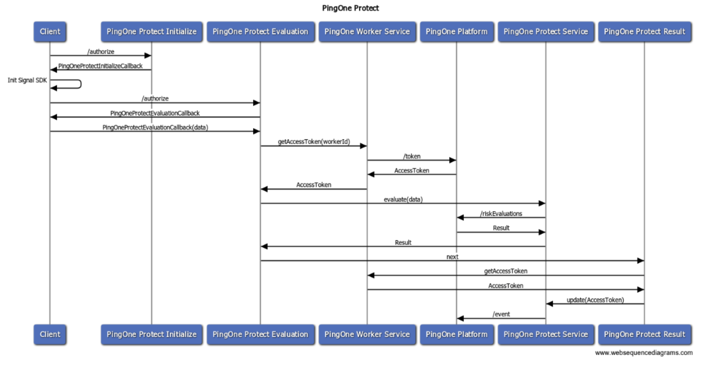
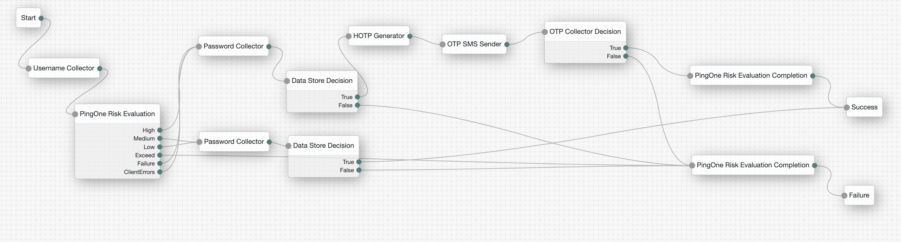
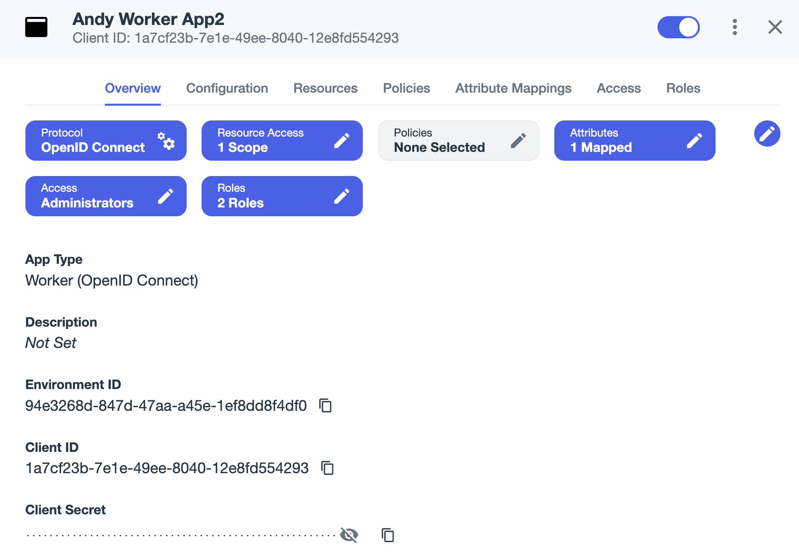
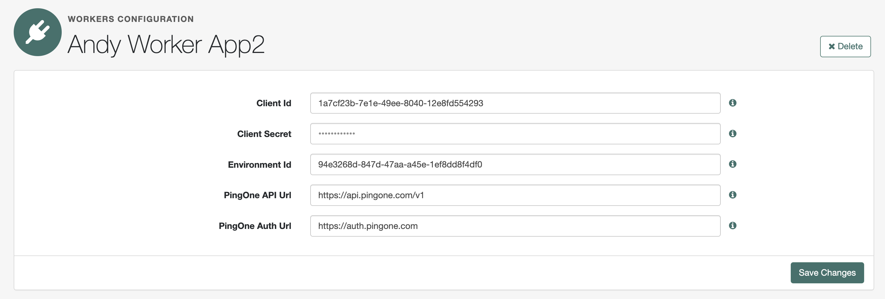
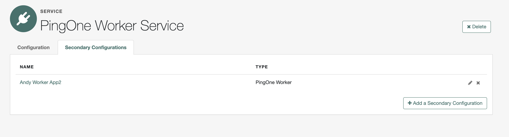
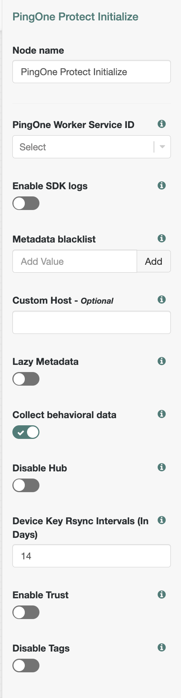
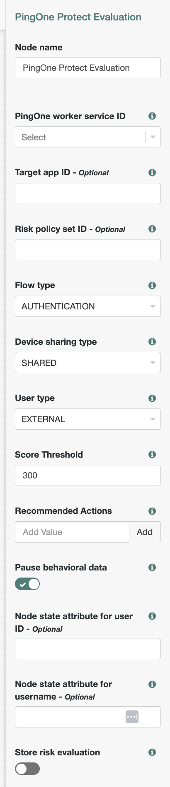
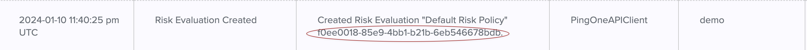
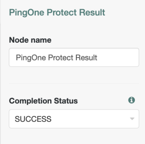

<h1 id="title-text" class="with-breadcrumbs" style="display: block;">
                                                <a href="/confluence/pages/viewpage.action?pageId=174753324">PingOne Protect Node &amp; SDK (Latest)</a>
                                    </h1>

<ul style=""><li>1 <a href="#PingOneProtectNode&amp;SDK(Latest)-ServerArchitectureDesign" class="toc-link">Server Architecture Design</a><ul style=""><li>1.1 <a href="#PingOneProtectNode&amp;SDK(Latest)-PingOneWorkerService" class="toc-link">PingOne Worker Service</a></li><li>1.2 <a href="#PingOneProtectNode&amp;SDK(Latest)-PingOneProtectInitializeNode" class="toc-link">PingOne Protect Initialize Node</a></li><li>1.3 <a href="#PingOneProtectNode&amp;SDK(Latest)-PingOneProtectEvaluationNode" class="toc-link">PingOne Protect Evaluation Node</a><ul style=""><li>1.3.1 <a href="#PingOneProtectNode&amp;SDK(Latest)-Outcomeresultprecedence" class="toc-link">Outcome result precedence</a></li><li>1.3.2 <a href="#PingOneProtectNode&amp;SDK(Latest)-Callback" class="toc-link">Callback</a></li><li>1.3.3 <a href="#PingOneProtectNode&amp;SDK(Latest)-Audit" class="toc-link">Audit</a></li><li>1.3.4 <a href="#PingOneProtectNode&amp;SDK(Latest)-SampleRequest&amp;Response" class="toc-link">Sample Request &amp; Response</a></li></ul></li><li>1.4 <a href="#PingOneProtectNode&amp;SDK(Latest)-PingOneProtectResultNode" class="toc-link">PingOne Protect Result Node</a></li></ul></li></ul>

This document includes the detailed design of a new Authentication Journey Node which integrates with <a class="external-link" href="https://apidocs.pingidentity.com/pingone/platform/v1/api/#pingone-protect" rel="nofollow">PingOne Protect</a>, the PingOne Protect service provides capabilities to configure and retrieve risk evaluations from internal and external risk providers based on a specified risk policy.

<h1 id="PingOneProtectNode&amp;SDK(Latest)-ServerArchitectureDesign">Server Architecture Design</h1>

<table class="wrapped confluenceTable tablesorter tablesorter-default stickyTableHeaders" role="grid" style="padding: 0px;" resolved=""><colgroup><col><col></colgroup><thead class="tableFloatingHeaderOriginal" style="position: static; margin-top: 0px; left: 325px; z-index: 3; width: 983px; top: 91px;"><tr role="row" class="tablesorter-headerRow"><th scope="col" class="confluenceTh tablesorter-header sortableHeader tablesorter-headerUnSorted" data-column="0" tabindex="0" role="columnheader" aria-disabled="false" unselectable="on" aria-sort="none" aria-label="Component: No sort applied, activate to apply an ascending sort" style="user-select: none; min-width: 8px; max-width: none;">
Component
</th><th scope="col" class="confluenceTh tablesorter-header sortableHeader tablesorter-headerUnSorted" data-column="1" tabindex="0" role="columnheader" aria-disabled="false" unselectable="on" aria-sort="none" aria-label="Description: No sort applied, activate to apply an ascending sort" style="user-select: none; min-width: 8px; max-width: none;">

Description</th></tr></thead><tbody aria-live="polite" aria-relevant="all"><tr role="row"><td class="confluenceTd">PingOne Risk Initialize Node</td><td class="confluenceTd">Provide Signal SDK configuration attribute, and instruct the client to initialize the Signal SDK.</td></tr><tr role="row"><td class="confluenceTd">PingOne Risk Evaluation Node</td><td class="confluenceTd">Handle requests and responses from clients, analyze risk results, and route to outcome.&nbsp;</td></tr><tr role="row"><td class="confluenceTd">PingOne Risk Result Node</td><td class="confluenceTd">Update evaluation authentication status.</td></tr><tr role="row"><td class="confluenceTd">PingOne Worker Service</td><td class="confluenceTd">
Manage PingOne AccessToken, Client Credential OAuth2 Request to PingOne Platform, and cache the AccessToken.

This component can be reused by other PingOne integrations. For example, PingOne Verify.
</td></tr><tr role="row"><td class="confluenceTd">PingOne Protect Service</td><td class="confluenceTd">As API Client to PingOne Protect APIs.</td></tr></tbody></table>

A typical journey to use OTP when Risk is High.

## PingOne Worker Service

Work with the PingOne Worker Application (With <strong>Roles Environment Admin</strong> and <strong>Identity Data Admin</strong>) and retrieve a Client Credential Grant Access Token, the Access Token will be cached until expires or the service configuration is updated.

 

Support Multiple PingOne Worker, each worker works with each PingOne Application

<h2 id="PingOneProtectNode&amp;SDK(Latest)-PingOneProtectInitializeNode">PingOne Protect Initialize Node</h2>

Instruct the client to initialize the SDK

<table border="0" cellpadding="0" cellspacing="0"><tbody><tr><td class="code">

<code class="xml plain">{</code>

<code class="xml spaces">&nbsp;&nbsp;&nbsp;&nbsp;&nbsp;&nbsp;&nbsp;&nbsp;&nbsp;&nbsp;&nbsp;&nbsp;</code><code class="xml plain">"type": "PingOneProtectInitializeCallback",</code>

<code class="xml spaces">&nbsp;&nbsp;&nbsp;&nbsp;&nbsp;&nbsp;&nbsp;&nbsp;&nbsp;&nbsp;&nbsp;&nbsp;</code><code class="xml plain">"output": [</code>

<code class="xml spaces">&nbsp;&nbsp;&nbsp;&nbsp;&nbsp;&nbsp;&nbsp;&nbsp;&nbsp;&nbsp;&nbsp;&nbsp;&nbsp;&nbsp;&nbsp;&nbsp;</code><code class="xml plain">{</code>

<code class="xml spaces">&nbsp;&nbsp;&nbsp;&nbsp;&nbsp;&nbsp;&nbsp;&nbsp;&nbsp;&nbsp;&nbsp;&nbsp;&nbsp;&nbsp;&nbsp;&nbsp;&nbsp;&nbsp;&nbsp;&nbsp;</code><code class="xml plain">"name": "envId",</code>

<code class="xml spaces">&nbsp;&nbsp;&nbsp;&nbsp;&nbsp;&nbsp;&nbsp;&nbsp;&nbsp;&nbsp;&nbsp;&nbsp;&nbsp;&nbsp;&nbsp;&nbsp;&nbsp;&nbsp;&nbsp;&nbsp;</code><code class="xml plain">"value": "test"</code>

<code class="xml spaces">&nbsp;&nbsp;&nbsp;&nbsp;&nbsp;&nbsp;&nbsp;&nbsp;&nbsp;&nbsp;&nbsp;&nbsp;&nbsp;&nbsp;&nbsp;&nbsp;</code><code class="xml plain">},</code>

<code class="xml spaces">&nbsp;&nbsp;&nbsp;&nbsp;&nbsp;&nbsp;&nbsp;&nbsp;&nbsp;&nbsp;&nbsp;&nbsp;&nbsp;&nbsp;&nbsp;&nbsp;</code><code class="xml plain">{</code>

<code class="xml spaces">&nbsp;&nbsp;&nbsp;&nbsp;&nbsp;&nbsp;&nbsp;&nbsp;&nbsp;&nbsp;&nbsp;&nbsp;&nbsp;&nbsp;&nbsp;&nbsp;&nbsp;&nbsp;&nbsp;&nbsp;</code><code class="xml plain">"name": "consoleLogEnabled",</code>

<code class="xml spaces">&nbsp;&nbsp;&nbsp;&nbsp;&nbsp;&nbsp;&nbsp;&nbsp;&nbsp;&nbsp;&nbsp;&nbsp;&nbsp;&nbsp;&nbsp;&nbsp;&nbsp;&nbsp;&nbsp;&nbsp;</code><code class="xml plain">"value": false</code>

<code class="xml spaces">&nbsp;&nbsp;&nbsp;&nbsp;&nbsp;&nbsp;&nbsp;&nbsp;&nbsp;&nbsp;&nbsp;&nbsp;&nbsp;&nbsp;&nbsp;&nbsp;</code><code class="xml plain">},</code>

<code class="xml spaces">&nbsp;&nbsp;&nbsp;&nbsp;&nbsp;&nbsp;&nbsp;&nbsp;&nbsp;&nbsp;&nbsp;&nbsp;&nbsp;&nbsp;&nbsp;&nbsp;</code><code class="xml plain">{</code>

<code class="xml spaces">&nbsp;&nbsp;&nbsp;&nbsp;&nbsp;&nbsp;&nbsp;&nbsp;&nbsp;&nbsp;&nbsp;&nbsp;&nbsp;&nbsp;&nbsp;&nbsp;&nbsp;&nbsp;&nbsp;&nbsp;</code><code class="xml plain">"name": "deviceAttributesToIgnore",</code>

<code class="xml spaces">&nbsp;&nbsp;&nbsp;&nbsp;&nbsp;&nbsp;&nbsp;&nbsp;&nbsp;&nbsp;&nbsp;&nbsp;&nbsp;&nbsp;&nbsp;&nbsp;&nbsp;&nbsp;&nbsp;&nbsp;</code><code class="xml plain">"value": [</code>

<code class="xml spaces">&nbsp;&nbsp;&nbsp;&nbsp;&nbsp;&nbsp;&nbsp;&nbsp;&nbsp;&nbsp;&nbsp;&nbsp;&nbsp;&nbsp;&nbsp;&nbsp;&nbsp;&nbsp;&nbsp;&nbsp;&nbsp;&nbsp;&nbsp;&nbsp;</code><code class="xml plain">"field1",</code>

<code class="xml spaces">&nbsp;&nbsp;&nbsp;&nbsp;&nbsp;&nbsp;&nbsp;&nbsp;&nbsp;&nbsp;&nbsp;&nbsp;&nbsp;&nbsp;&nbsp;&nbsp;&nbsp;&nbsp;&nbsp;&nbsp;&nbsp;&nbsp;&nbsp;&nbsp;</code><code class="xml plain">"field2"</code>

<code class="xml spaces">&nbsp;&nbsp;&nbsp;&nbsp;&nbsp;&nbsp;&nbsp;&nbsp;&nbsp;&nbsp;&nbsp;&nbsp;&nbsp;&nbsp;&nbsp;&nbsp;&nbsp;&nbsp;&nbsp;&nbsp;</code><code class="xml plain">]</code>

<code class="xml spaces">&nbsp;&nbsp;&nbsp;&nbsp;&nbsp;&nbsp;&nbsp;&nbsp;&nbsp;&nbsp;&nbsp;&nbsp;&nbsp;&nbsp;&nbsp;&nbsp;</code><code class="xml plain">},</code>

<code class="xml spaces">&nbsp;&nbsp;&nbsp;&nbsp;&nbsp;&nbsp;&nbsp;&nbsp;&nbsp;&nbsp;&nbsp;&nbsp;&nbsp;&nbsp;&nbsp;&nbsp;</code><code class="xml plain">{</code>

<code class="xml spaces">&nbsp;&nbsp;&nbsp;&nbsp;&nbsp;&nbsp;&nbsp;&nbsp;&nbsp;&nbsp;&nbsp;&nbsp;&nbsp;&nbsp;&nbsp;&nbsp;&nbsp;&nbsp;&nbsp;&nbsp;</code><code class="xml plain">"name": "customHost",</code>

<code class="xml spaces">&nbsp;&nbsp;&nbsp;&nbsp;&nbsp;&nbsp;&nbsp;&nbsp;&nbsp;&nbsp;&nbsp;&nbsp;&nbsp;&nbsp;&nbsp;&nbsp;&nbsp;&nbsp;&nbsp;&nbsp;</code><code class="xml plain">"value": ""</code>

<code class="xml spaces">&nbsp;&nbsp;&nbsp;&nbsp;&nbsp;&nbsp;&nbsp;&nbsp;&nbsp;&nbsp;&nbsp;&nbsp;&nbsp;&nbsp;&nbsp;&nbsp;</code><code class="xml plain">},</code>

<code class="xml spaces">&nbsp;&nbsp;&nbsp;&nbsp;&nbsp;&nbsp;&nbsp;&nbsp;&nbsp;&nbsp;&nbsp;&nbsp;&nbsp;&nbsp;&nbsp;&nbsp;</code><code class="xml plain">{</code>

<code class="xml spaces">&nbsp;&nbsp;&nbsp;&nbsp;&nbsp;&nbsp;&nbsp;&nbsp;&nbsp;&nbsp;&nbsp;&nbsp;&nbsp;&nbsp;&nbsp;&nbsp;&nbsp;&nbsp;&nbsp;&nbsp;</code><code class="xml plain">"name": "lazyMetadata",</code>

<code class="xml spaces">&nbsp;&nbsp;&nbsp;&nbsp;&nbsp;&nbsp;&nbsp;&nbsp;&nbsp;&nbsp;&nbsp;&nbsp;&nbsp;&nbsp;&nbsp;&nbsp;&nbsp;&nbsp;&nbsp;&nbsp;</code><code class="xml plain">"value": false</code>

<code class="xml spaces">&nbsp;&nbsp;&nbsp;&nbsp;&nbsp;&nbsp;&nbsp;&nbsp;&nbsp;&nbsp;&nbsp;&nbsp;&nbsp;&nbsp;&nbsp;&nbsp;</code><code class="xml plain">},</code>

<code class="xml spaces">&nbsp;&nbsp;&nbsp;&nbsp;&nbsp;&nbsp;&nbsp;&nbsp;&nbsp;&nbsp;&nbsp;&nbsp;&nbsp;&nbsp;&nbsp;&nbsp;</code><code class="xml plain">{</code>

<code class="xml spaces">&nbsp;&nbsp;&nbsp;&nbsp;&nbsp;&nbsp;&nbsp;&nbsp;&nbsp;&nbsp;&nbsp;&nbsp;&nbsp;&nbsp;&nbsp;&nbsp;&nbsp;&nbsp;&nbsp;&nbsp;</code><code class="xml plain">"name": "behavioralDataCollection",</code>

<code class="xml spaces">&nbsp;&nbsp;&nbsp;&nbsp;&nbsp;&nbsp;&nbsp;&nbsp;&nbsp;&nbsp;&nbsp;&nbsp;&nbsp;&nbsp;&nbsp;&nbsp;&nbsp;&nbsp;&nbsp;&nbsp;</code><code class="xml plain">"value": true</code>

<code class="xml spaces">&nbsp;&nbsp;&nbsp;&nbsp;&nbsp;&nbsp;&nbsp;&nbsp;&nbsp;&nbsp;&nbsp;&nbsp;&nbsp;&nbsp;&nbsp;&nbsp;</code><code class="xml plain">},</code>

<code class="xml spaces">&nbsp;&nbsp;&nbsp;&nbsp;&nbsp;&nbsp;&nbsp;&nbsp;&nbsp;&nbsp;&nbsp;&nbsp;&nbsp;&nbsp;&nbsp;&nbsp;</code><code class="xml plain">{</code>

<code class="xml spaces">&nbsp;&nbsp;&nbsp;&nbsp;&nbsp;&nbsp;&nbsp;&nbsp;&nbsp;&nbsp;&nbsp;&nbsp;&nbsp;&nbsp;&nbsp;&nbsp;&nbsp;&nbsp;&nbsp;&nbsp;</code><code class="xml plain">"name": "deviceKeyRsyncIntervals",</code>

<code class="xml spaces">&nbsp;&nbsp;&nbsp;&nbsp;&nbsp;&nbsp;&nbsp;&nbsp;&nbsp;&nbsp;&nbsp;&nbsp;&nbsp;&nbsp;&nbsp;&nbsp;&nbsp;&nbsp;&nbsp;&nbsp;</code><code class="xml plain">"value": 14</code>

<code class="xml spaces">&nbsp;&nbsp;&nbsp;&nbsp;&nbsp;&nbsp;&nbsp;&nbsp;&nbsp;&nbsp;&nbsp;&nbsp;&nbsp;&nbsp;&nbsp;&nbsp;</code><code class="xml plain">},</code>

<code class="xml spaces">&nbsp;&nbsp;&nbsp;&nbsp;&nbsp;&nbsp;&nbsp;&nbsp;&nbsp;&nbsp;&nbsp;&nbsp;&nbsp;&nbsp;&nbsp;&nbsp;</code><code class="xml plain">{</code>

<code class="xml spaces">&nbsp;&nbsp;&nbsp;&nbsp;&nbsp;&nbsp;&nbsp;&nbsp;&nbsp;&nbsp;&nbsp;&nbsp;&nbsp;&nbsp;&nbsp;&nbsp;&nbsp;&nbsp;&nbsp;&nbsp;</code><code class="xml plain">"name": "enableTrust",</code>

<code class="xml spaces">&nbsp;&nbsp;&nbsp;&nbsp;&nbsp;&nbsp;&nbsp;&nbsp;&nbsp;&nbsp;&nbsp;&nbsp;&nbsp;&nbsp;&nbsp;&nbsp;&nbsp;&nbsp;&nbsp;&nbsp;</code><code class="xml plain">"value": false</code>

<code class="xml spaces">&nbsp;&nbsp;&nbsp;&nbsp;&nbsp;&nbsp;&nbsp;&nbsp;&nbsp;&nbsp;&nbsp;&nbsp;&nbsp;&nbsp;&nbsp;&nbsp;</code><code class="xml plain">},</code>

<code class="xml spaces">&nbsp;&nbsp;&nbsp;&nbsp;&nbsp;&nbsp;&nbsp;&nbsp;&nbsp;&nbsp;&nbsp;&nbsp;&nbsp;&nbsp;&nbsp;&nbsp;</code><code class="xml plain">{</code>

<code class="xml spaces">&nbsp;&nbsp;&nbsp;&nbsp;&nbsp;&nbsp;&nbsp;&nbsp;&nbsp;&nbsp;&nbsp;&nbsp;&nbsp;&nbsp;&nbsp;&nbsp;&nbsp;&nbsp;&nbsp;&nbsp;</code><code class="xml plain">"name": "disableTags",</code>

<code class="xml spaces">&nbsp;&nbsp;&nbsp;&nbsp;&nbsp;&nbsp;&nbsp;&nbsp;&nbsp;&nbsp;&nbsp;&nbsp;&nbsp;&nbsp;&nbsp;&nbsp;&nbsp;&nbsp;&nbsp;&nbsp;</code><code class="xml plain">"value": false</code>

<code class="xml spaces">&nbsp;&nbsp;&nbsp;&nbsp;&nbsp;&nbsp;&nbsp;&nbsp;&nbsp;&nbsp;&nbsp;&nbsp;&nbsp;&nbsp;&nbsp;&nbsp;</code><code class="xml plain">},</code>

<code class="xml spaces">&nbsp;&nbsp;&nbsp;&nbsp;&nbsp;&nbsp;&nbsp;&nbsp;&nbsp;&nbsp;&nbsp;&nbsp;&nbsp;&nbsp;&nbsp;&nbsp;</code><code class="xml plain">{</code>

<code class="xml spaces">&nbsp;&nbsp;&nbsp;&nbsp;&nbsp;&nbsp;&nbsp;&nbsp;&nbsp;&nbsp;&nbsp;&nbsp;&nbsp;&nbsp;&nbsp;&nbsp;&nbsp;&nbsp;&nbsp;&nbsp;</code><code class="xml plain">"name": "disableHub",</code>

<code class="xml spaces">&nbsp;&nbsp;&nbsp;&nbsp;&nbsp;&nbsp;&nbsp;&nbsp;&nbsp;&nbsp;&nbsp;&nbsp;&nbsp;&nbsp;&nbsp;&nbsp;&nbsp;&nbsp;&nbsp;&nbsp;</code><code class="xml plain">"value": false</code>

<code class="xml spaces">&nbsp;&nbsp;&nbsp;&nbsp;&nbsp;&nbsp;&nbsp;&nbsp;&nbsp;&nbsp;&nbsp;&nbsp;&nbsp;&nbsp;&nbsp;&nbsp;</code><code class="xml plain">}</code>

<code class="xml spaces">&nbsp;&nbsp;&nbsp;&nbsp;&nbsp;&nbsp;&nbsp;&nbsp;&nbsp;&nbsp;&nbsp;&nbsp;</code><code class="xml plain">],</code>

<code class="xml spaces">&nbsp;&nbsp;&nbsp;&nbsp;&nbsp;&nbsp;&nbsp;&nbsp;&nbsp;&nbsp;&nbsp;&nbsp;</code><code class="xml plain">"input": [</code>

<code class="xml spaces">&nbsp;&nbsp;&nbsp;&nbsp;&nbsp;&nbsp;&nbsp;&nbsp;&nbsp;&nbsp;&nbsp;&nbsp;&nbsp;&nbsp;&nbsp;&nbsp;</code><code class="xml plain">{</code>

<code class="xml spaces">&nbsp;&nbsp;&nbsp;&nbsp;&nbsp;&nbsp;&nbsp;&nbsp;&nbsp;&nbsp;&nbsp;&nbsp;&nbsp;&nbsp;&nbsp;&nbsp;&nbsp;&nbsp;&nbsp;&nbsp;</code><code class="xml plain">"name": "IDToken1clientError",</code>

<code class="xml spaces">&nbsp;&nbsp;&nbsp;&nbsp;&nbsp;&nbsp;&nbsp;&nbsp;&nbsp;&nbsp;&nbsp;&nbsp;&nbsp;&nbsp;&nbsp;&nbsp;&nbsp;&nbsp;&nbsp;&nbsp;</code><code class="xml plain">"value": ""</code>

<code class="xml spaces">&nbsp;&nbsp;&nbsp;&nbsp;&nbsp;&nbsp;&nbsp;&nbsp;&nbsp;&nbsp;&nbsp;&nbsp;&nbsp;&nbsp;&nbsp;&nbsp;</code><code class="xml plain">}</code>

<code class="xml spaces">&nbsp;&nbsp;&nbsp;&nbsp;&nbsp;&nbsp;&nbsp;&nbsp;&nbsp;&nbsp;&nbsp;&nbsp;</code><code class="xml plain">]</code>

<code class="xml spaces">&nbsp;&nbsp;&nbsp;&nbsp;&nbsp;&nbsp;&nbsp;&nbsp;</code><code class="xml plain">}</code>

</td></tr></tbody></table>

## PingOne Protect Evaluation Node

Provide input to the <a class="external-link" href="https://apidocs.pingidentity.com/pingone/platform/v1/api/#post-create-risk-evaluation" rel="nofollow">Create Risk Evaluation</a> API and evaluate response.

<table class="wrapped confluenceTable tablesorter tablesorter-default stickyTableHeaders" role="grid" style="padding: 0px;" resolved=""><colgroup><col><col></colgroup><thead class="tableFloatingHeaderOriginal" style="position: static; margin-top: 0px; left: 325px; z-index: 3; width: 1283px; top: 91px;"><tr role="row" class="tablesorter-headerRow"><th scope="col" class="confluenceTh tablesorter-header sortableHeader tablesorter-headerUnSorted" data-column="0" tabindex="0" role="columnheader" aria-disabled="false" unselectable="on" aria-sort="none" aria-label="Label (*PingOne API specific attribute): No sort applied, activate to apply an ascending sort" style="user-select: none; min-width: 8px; max-width: none;">
Label (*PingOne API specific attribute)
</th><th scope="col" class="confluenceTh tablesorter-header sortableHeader tablesorter-headerUnSorted" data-column="1" tabindex="0" role="columnheader" aria-disabled="false" unselectable="on" aria-sort="none" aria-label="Description (Some attribute definitions can be found here): No sort applied, activate to apply an ascending sort" style="user-select: none; min-width: 8px; max-width: none;">
Description (Some attribute definitions can be found <a class="external-link" href="https://apidocs.pingidentity.com/pingone/platform/v1/api/#risk-evaluations" rel="nofollow">here</a>)
</th></tr></thead><tbody aria-live="polite" aria-relevant="all"><tr role="row"><td class="confluenceTd">PingOne Worker Service ID</td><td class="confluenceTd">The identifier of your PingOne Worker service you create to connect to the Google Play Integrity servers.</td></tr><tr role="row"><td class="confluenceTd">Score Threshold Exceed</td><td class="confluenceTd">Outcome to exceed when risk score is greater than score limit. (Recommend by Itai Zach Default to 300)</td></tr><tr role="row"><td class="confluenceTd">The ID of the target application.&nbsp;-&nbsp;<em class="small">Optional</em></td><td class="confluenceTd">The ID of the target application.</td></tr><tr role="row"><td class="confluenceTd">The risk policy set's unique identifier.&nbsp;-&nbsp;<em class="small">Optional</em></td><td class="confluenceTd">The risk policy set's unique identifier. if not specified, the environment's default risk policy set is used.</td></tr><tr role="row"><td class="confluenceTd">Flow Type</td><td class="confluenceTd">The type of flow for which the risk evaluation is being carried out. Can take any of the following values:<ul><li>"REGISTRATION" - initial registration of an account</li><li>"AUTHENTICATION" - standard authentication for login or actions such as password change</li><li>"ACCESS" - verification of whether user can access the relevant application, using tools such as PingAccess</li><li>"AUTHORIZATION" - verification of whether user is authorized to perform a specific action such as a profile change, using tools such as PingOne Authorize</li><li>"TRANSACTION" - authentication carried out in the context of a purchase or other monetary transaction</li></ul></td></tr><tr role="row"><td class="confluenceTd">Device Sharing Type</td><td class="confluenceTd">The device sharing type. Options are UNSPECIFIED, SHARED, and PRIVATE.</td></tr><tr role="row"><td class="confluenceTd">Shared state attribute for UserId&nbsp;-&nbsp;<em class="small">Optional</em></td><td class="confluenceTd">
The Node state variable that contains the user.id as it appears in PingOne. &nbsp; If left blank, the node uses the current context Username as the user.id
</td></tr><tr role="row"><td class="confluenceTd">Shared state attribute for Username&nbsp;-&nbsp;<em class="small">Optional</em></td><td class="confluenceTd"><pre data-bidi-marker="true">The Node state variable that contains the <a class="external-link" href="http://user.name" rel="nofollow">user.name</a> as it appears in PingOne. &nbsp; If left blank, the node uses the current context Username as the <a class="external-link" href="http://user.name" rel="nofollow">user.name</a>.</pre></td></tr><tr role="row"><td class="confluenceTd">User Type</td><td class="confluenceTd">The type of user associated with the event. The possible values are PING_ONE and EXTERNAL.</td></tr><tr role="row"><td class="confluenceTd">Store Risk Evaluation Result In Transient State</td><td class="confluenceTd">
Stores the risk evaluation response in the <strong>transient</strong> <strong>state</strong> with the key named&nbsp;<strong><code>PingOneRiskEvaluationNode.RISK</code>.</strong> <em>Note</em>: The key is empty if the node cannot retrieve the risk from PingOne.
</td></tr><tr role="row"><td class="confluenceTd">Recommended Action</td><td class="confluenceTd">
Dynamic Outcome for recommendation Action
</td></tr><tr role="row"><td class="confluenceTd">Pause Behavioral Data</td><td class="confluenceTd">
Instruct the client to pause behavioral data.
</td></tr><tr role="row"><td class="confluenceTd">Client error outcomes</td><td class="confluenceTd">Specify the custom error outcomes that the client can return.</td></tr></tbody></table>

 The Node parses part of the API response and routes to the corresponding outcome (according to the <a class="external-link" href="https://docs.pingidentity.com/r/en-us/pingone/pingone_protect_best_practices" rel="nofollow">best practice</a>, it should use score-based policies):

<table border="0" cellpadding="0" cellspacing="0"><tbody><tr><td class="code">

<code class="yml spaces">&nbsp;&nbsp;&nbsp;&nbsp;</code><code class="yml string">"result"</code><code class="yml constants">:</code> <code class="yml constants">{</code>

<code class="yml spaces">&nbsp;&nbsp;&nbsp;&nbsp;&nbsp;&nbsp;&nbsp;</code><code class="yml string">"level"</code><code class="yml constants">:</code> <code class="yml string">"MEDIUM"</code><code class="yml constants">,</code>

<code class="yml spaces">&nbsp;&nbsp;&nbsp;&nbsp;&nbsp;&nbsp;&nbsp;</code><code class="yml string">"score"</code><code class="yml constants">:</code> <code class="yml plain">1.4285714285714286</code><code class="yml constants">,</code>

<code class="yml spaces">&nbsp;&nbsp;&nbsp;&nbsp;&nbsp;&nbsp;&nbsp;</code><code class="yml string">"source"</code><code class="yml constants">:</code> <code class="yml string">"AGGREGATED_WEIGHTS"</code><code class="yml constants">,</code>

<code class="yml spaces">&nbsp;&nbsp;&nbsp;&nbsp;&nbsp;&nbsp;&nbsp;</code><code class="yml string">"type"</code><code class="yml constants">:</code> <code class="yml string">"VALUE"</code><code class="yml constants">,</code>

<code class="yml spaces">&nbsp;&nbsp;&nbsp;&nbsp;&nbsp;&nbsp;&nbsp;</code><code class="yml string">"recommendedAction"</code> <code class="yml constants">:</code> <code class="yml string">"BOT_MITIGATION"</code>

<code class="yml spaces">&nbsp;&nbsp;&nbsp; </code><code class="yml constants">}</code>

</td></tr></tbody></table>

<table class="wrapped confluenceTable tablesorter tablesorter-default stickyTableHeaders" role="grid" style="padding: 0px;" resolved=""><colgroup><col><col><col></colgroup><thead class="tableFloatingHeaderOriginal" style="position: static; margin-top: 0px; left: 325px; z-index: 3; width: 1283px; top: 91px;"><tr role="row" class="tablesorter-headerRow"><th scope="col" class="confluenceTh tablesorter-header sortableHeader tablesorter-headerUnSorted" data-column="0" tabindex="0" role="columnheader" aria-disabled="false" unselectable="on" aria-sort="none" aria-label="Result: No sort applied, activate to apply an ascending sort" style="user-select: none; min-width: 8px; max-width: none;">
Result
</th><th scope="col" class="confluenceTh tablesorter-header sortableHeader tablesorter-headerUnSorted" data-column="1" tabindex="0" role="columnheader" aria-disabled="false" unselectable="on" aria-sort="none" aria-label="Outcome: No sort applied, activate to apply an ascending sort" style="user-select: none; min-width: 8px; max-width: none;">
Outcome
</th><th scope="col" class="confluenceTh tablesorter-header sortableHeader tablesorter-headerUnSorted" data-column="2" tabindex="0" role="columnheader" aria-disabled="false" unselectable="on" aria-sort="none" aria-label="Description: No sort applied, activate to apply an ascending sort" style="user-select: none; min-width: 8px; max-width: none;">
Description
</th></tr></thead></thead><tbody aria-live="polite" aria-relevant="all"><tr role="row"><td class="confluenceTd">result.score &gt; ${score limit}</td><td class="confluenceTd"> Exceed Score Threshold</td><td class="confluenceTd">The risk is too high, recommend not to accept the authentication</td></tr><tr role="row"><td class="confluenceTd">result.level = HIGH</td><td class="confluenceTd">High</td><td class="confluenceTd">High-Risk</td></tr><tr role="row"><td class="confluenceTd">result.level = MEDIUM</td><td class="confluenceTd">Medium</td><td class="confluenceTd">Medium-Risk</td></tr><tr role="row"><td class="confluenceTd">result.level = LOW</td><td class="confluenceTd">Low</td><td class="confluenceTd">Low-Risk</td></tr><tr role="row"><td class="confluenceTd"> </td><td class="confluenceTd">&lt;Configurable Outcome&gt;</td><td class="confluenceTd">If result with recommendedAction, and match with the predefined "Recommended Actions", the Node will route to the recommended Action outcome.</td></tr><tr role="row"><td class="confluenceTd"> </td><td class="confluenceTd">Failure</td><td class="confluenceTd">Any failure to retrieve the API result, e.g. Invalid Access Token, Network Error, API Error, etc...</td></tr><tr role="row"><td class="confluenceTd"> </td><td class="confluenceTd">ClientErrors</td><td class="confluenceTd">Any error from the client or SDK</td></tr></tbody></table>

After successfully calling the API, the Shared State "PingOneRiskEvaluationNode.riskEvalID" will be set with the created
ID, and later on we need to use the riskEvalID to update the evaluation status with PingOne Risk Result Node.

<h3 id="PingOneProtectNode&amp;SDK(Latest)-Outcomeresultprecedence">Outcome result 
precedence</h3>

<table class="wrapped confluenceTable stickyTableHeaders" resolved="" style="padding: 0px;"><thead class="tableFloatingHeaderOriginal" style="position: static; margin-top: 0px; left: 325px; z-index: 3; width: 983px; top: 91px;"><tr><th scope="col" class="confluenceTh" style="min-width: 8px; max-width: none;">Exceed Score Threshold)</th><th scope="col" class="confluenceTh" style="min-width: 8px; max-width: none;">→&nbsp;</th><th scope="col" class="confluenceTh" style="min-width: 8px; max-width: none;">Recommended Action (When response with recommendedAction and match with predefined</th><th scope="col" class="confluenceTh" style="min-width: 8px; max-width: none;">→&nbsp;</th><th scope="col" class="confluenceTh" style="min-width: 8px; max-width: none;">Level</th></tr></thead><colgroup><col><col><col><col><col></colgroup><tbody></tbody></table>

<h3 id="PingOneProtectNode&amp;SDK(Latest)-Callback">Callback</h3>

Callback to instruct the client to collect the device signals:

<table class="relative-table wrapped confluenceTable tablesorter tablesorter-default stickyTableHeaders" style="width: 45.4469%; padding: 0px;" role="grid" resolved=""><colgroup><col style="width: 24.6882%;"><col style="width: 75.28%;"></colgroup><thead class="tableFloatingHeaderOriginal" style="position: static; margin-top: 0px; left: 325px; z-index: 3; width: 649px; top: 91px;"><tr role="row" class="tablesorter-headerRow"><th scope="col" class="confluenceTh tablesorter-header sortableHeader tablesorter-headerUnSorted" data-column="0" tabindex="0" role="columnheader" aria-disabled="false" unselectable="on" aria-sort="none" aria-label=": No sort applied, activate to apply an ascending sort" style="user-select: none; min-width: 8px; max-width: none;">
 
</th><th scope="col" class="confluenceTh tablesorter-header sortableHeader tablesorter-headerUnSorted" data-column="1" tabindex="0" role="columnheader" aria-disabled="false" unselectable="on" aria-sort="none" aria-label="PingOneRiskEvaluationCallback: No sort applied, activate to apply an ascending sort" style="user-select: none; min-width: 8px; max-width: none;">
PingOneRiskEvaluationCallback
</th></tr></thead><thead class="tableFloatingHeader" style="display: none;"><tr role="row" class="tablesorter-headerRow"><th scope="col" class="confluenceTh tablesorter-header sortableHeader tablesorter-headerUnSorted" data-column="0" tabindex="0" role="columnheader" aria-disabled="false" unselectable="on" aria-sort="none" aria-label=": No sort applied, activate to apply an ascending sort" style="user-select: none;">
 
</th><th scope="col" class="confluenceTh tablesorter-header sortableHeader tablesorter-headerUnSorted" data-column="1" tabindex="0" role="columnheader" aria-disabled="false" unselectable="on" aria-sort="none" aria-label="PingOneRiskEvaluationCallback: No sort applied, activate to apply an ascending sort" style="user-select: none;">

</th></tr></thead><tbody aria-live="polite" aria-relevant="all"><tr role="row"><td class="confluenceTd">Example</td><td class="confluenceTd">

<table border="0" cellpadding="0" cellspacing="0"><tbody><tr><td class="code">

<code class="yml string">"callbacks"</code><code class="yml constants">:</code> <code class="yml constants">[</code>

<code class="yml spaces">&nbsp;&nbsp;&nbsp;&nbsp;&nbsp;&nbsp;&nbsp;&nbsp;</code><code class="yml constants">{</code>

<code class="yml spaces">&nbsp;&nbsp;&nbsp;&nbsp;&nbsp;&nbsp;&nbsp;&nbsp;&nbsp;&nbsp;&nbsp;&nbsp;</code><code class="yml string">"type"</code><code class="yml constants">:</code> <code class="yml string">"PingOneRiskEvaluationCallback"</code><code class="yml constants">,</code>

<code class="yml spaces">&nbsp;&nbsp;&nbsp;&nbsp;&nbsp;&nbsp;&nbsp;&nbsp;&nbsp;&nbsp;&nbsp;&nbsp;</code><code class="yml string">"input"</code><code class="yml constants">:</code> <code class="yml constants">[</code>

<code class="yml spaces">&nbsp;&nbsp;&nbsp;&nbsp;&nbsp;&nbsp;&nbsp;&nbsp;&nbsp;&nbsp;&nbsp;&nbsp;&nbsp;&nbsp;&nbsp;&nbsp;</code><code class="yml constants">{</code>

<code class="yml spaces">&nbsp;&nbsp;&nbsp;&nbsp;&nbsp;&nbsp;&nbsp;&nbsp;&nbsp;&nbsp;&nbsp;&nbsp;&nbsp;&nbsp;&nbsp;&nbsp;&nbsp;&nbsp;&nbsp;&nbsp;</code><code class="yml string">"name"</code><code class="yml constants">:</code> <code class="yml string">"IDToken1"</code><code class="yml constants">,</code>

<code class="yml spaces">&nbsp;&nbsp;&nbsp;&nbsp;&nbsp;&nbsp;&nbsp;&nbsp;&nbsp;&nbsp;&nbsp;&nbsp;&nbsp;&nbsp;&nbsp;&nbsp;&nbsp;&nbsp;&nbsp;&nbsp;</code><code class="yml string">"value"</code><code class="yml constants">:</code> <code class="yml string">"pingone_risk_evaluation_signals"</code>

<code class="yml spaces">&nbsp;&nbsp;&nbsp;&nbsp;&nbsp;&nbsp;&nbsp;&nbsp;&nbsp;&nbsp;&nbsp;&nbsp;&nbsp;&nbsp;&nbsp;&nbsp;</code><code class="yml constants">}</code><code class="yml constants">,</code>

<code class="yml spaces">&nbsp;&nbsp;&nbsp;&nbsp;&nbsp;&nbsp;&nbsp;&nbsp;&nbsp;&nbsp;&nbsp;&nbsp;&nbsp;&nbsp;&nbsp;&nbsp;&nbsp;</code><code class="yml constants">{</code>

<code class="yml spaces">&nbsp;&nbsp;&nbsp;&nbsp;&nbsp;&nbsp;&nbsp;&nbsp;&nbsp;&nbsp;&nbsp;&nbsp;&nbsp;&nbsp;&nbsp;&nbsp;&nbsp;&nbsp;&nbsp;&nbsp;</code><code class="yml string">"name"</code><code class="yml constants">:</code> <code class="yml string">"IDToken2"</code><code class="yml constants">,</code>

<code class="yml spaces">&nbsp;&nbsp;&nbsp;&nbsp;&nbsp;&nbsp;&nbsp;&nbsp;&nbsp;&nbsp;&nbsp;&nbsp;&nbsp;&nbsp;&nbsp;&nbsp;&nbsp;&nbsp;&nbsp;&nbsp;</code><code class="yml string">"value"</code><code class="yml constants">:</code> <code class="yml string">"clientError"</code>

<code class="yml spaces">&nbsp;&nbsp;&nbsp;&nbsp;&nbsp;&nbsp;&nbsp;&nbsp;&nbsp;&nbsp;&nbsp;&nbsp;&nbsp;&nbsp;&nbsp;&nbsp;</code><code class="yml constants">}</code><code class="yml constants">,</code>

<code class="yml spaces">&nbsp;&nbsp;&nbsp;&nbsp;&nbsp;&nbsp;&nbsp;&nbsp;&nbsp;&nbsp;&nbsp;&nbsp;</code><code class="yml constants">]</code>

<code class="yml spaces">&nbsp;&nbsp;&nbsp;&nbsp;&nbsp;&nbsp;&nbsp;&nbsp;</code><code class="yml constants">}</code>

<code class="yml spaces">&nbsp;&nbsp;&nbsp;&nbsp;</code><code class="yml constants">]</code>

</td></tr></tbody></table>

</td></tr></tbody></table>

### Audit

<table class="wrapped confluenceTable tablesorter tablesorter-default stickyTableHeaders" role="grid" style="padding: 0px;" resolved=""><colgroup><col><col></colgroup><thead class="tableFloatingHeaderOriginal" style="position: static; margin-top: 0px; left: 325px; z-index: 3; width: 403px; top: 40px;"><tr role="row" class="tablesorter-headerRow"><th scope="col" class="confluenceTh tablesorter-header sortableHeader tablesorter-headerUnSorted" data-column="0" tabindex="0" role="columnheader" aria-disabled="false" unselectable="on" aria-sort="none" aria-label="Audit log attribute: No sort applied, activate to apply an ascending sort" style="user-select: none; min-width: 8px; max-width: none;">
Audit log attribute
</th><th scope="col" class="confluenceTh tablesorter-header sortableHeader tablesorter-headerUnSorted" data-column="1" tabindex="0" role="columnheader" aria-disabled="false" unselectable="on" aria-sort="none" aria-label="Description: No sort applied, activate to apply an ascending sort" style="user-select: none; min-width: 8px; max-width: none;">
Description
</th></tr></thead><thead class="tableFloatingHeader" style="display: none;"><tr role="row" class="tablesorter-headerRow"><th scope="col" class="confluenceTh tablesorter-header sortableHeader tablesorter-headerUnSorted" data-column="0" tabindex="0" role="columnheader" aria-disabled="false" unselectable="on" aria-sort="none" aria-label="Audit log attribute: No sort applied, activate to apply an ascending sort" style="user-select: none;">

</th><th scope="col" class="confluenceTh tablesorter-header sortableHeader tablesorter-headerUnSorted" data-column="1" tabindex="0" role="columnheader" aria-disabled="false" unselectable="on" aria-sort="none" aria-label="Description: No sort applied, activate to apply an ascending sort" style="user-select: none;">
Description
</th></tr></thead><tbody aria-live="polite" aria-relevant="all"><tr role="row"><td class="confluenceTd">PINGONE_RISK_EVALUATE_ID</td><td class="confluenceTd">The created evaluation Id</td></tr><tr role="row"><td class="confluenceTd">PINGONE_RISK_ENV_ID</td><td class="confluenceTd">The PingOne Env</td></tr></tbody></table>

<table border="0" cellpadding="0" cellspacing="0"><tbody><tr><td class="code">

<code class="xml plain">{</code>

<code class="xml spaces">&nbsp;&nbsp;</code><code class="xml plain">"_id": "240e8351-f47e-4284-a093-b6585592281f-32448",</code>

<code class="xml spaces">&nbsp;&nbsp;</code><code class="xml plain">"timestamp": "2024-01-10T23:40:25.002Z",</code>

<code class="xml spaces">&nbsp;&nbsp;</code><code class="xml plain">"eventName": "AM-NODE-LOGIN-COMPLETED",</code>

<code class="xml spaces">&nbsp;&nbsp;</code><code class="xml plain">"transactionId": "240e8351-f47e-4284-a093-b6585592281f-32412",</code>

<code class="xml spaces">&nbsp;&nbsp;</code><code class="xml plain">"trackingIds": [</code>

<code class="xml spaces">&nbsp;&nbsp;&nbsp;&nbsp;</code><code class="xml plain">"240e8351-f47e-4284-a093-b6585592281f-32372"</code>

<code class="xml spaces">&nbsp;&nbsp;</code><code class="xml plain">],</code>

<code class="xml spaces">&nbsp;&nbsp;</code><code class="xml plain">"principal": [</code>

<code class="xml spaces">&nbsp;&nbsp;&nbsp;&nbsp;</code><code class="xml plain">"demo"</code>

<code class="xml spaces">&nbsp;&nbsp;</code><code class="xml plain">],</code>

<code class="xml spaces">&nbsp;&nbsp;</code><code class="xml plain">"entries": [</code>

<code class="xml spaces">&nbsp;&nbsp;&nbsp;&nbsp;</code><code class="xml plain">{</code>

<code class="xml spaces">&nbsp;&nbsp;&nbsp;&nbsp;&nbsp;&nbsp;</code><code class="xml plain">"info": {</code>

<code class="xml spaces">&nbsp;&nbsp;&nbsp;&nbsp;&nbsp;&nbsp;&nbsp;&nbsp;</code><code class="xml plain">"nodeOutcome": "high",</code>

<code class="xml spaces">&nbsp;&nbsp;&nbsp;&nbsp;&nbsp;&nbsp;&nbsp;&nbsp;</code><code class="xml plain">"treeName": "protect",</code>

<code class="xml spaces">&nbsp;&nbsp;&nbsp;&nbsp;&nbsp;&nbsp;&nbsp;&nbsp;</code><code class="xml plain">"displayName": "PingOne Protect Evaluation",</code>

<code class="xml spaces">&nbsp;&nbsp;&nbsp;&nbsp;&nbsp;&nbsp;&nbsp;&nbsp;</code><code class="xml plain">"nodeType": "PingOneProtectEvaluationNode",</code>

<code class="xml spaces">&nbsp;&nbsp;&nbsp;&nbsp;&nbsp;&nbsp;&nbsp;&nbsp;</code><code class="xml plain">"nodeId": "a51a65ce-ff56-4862-a94c-2eb08b3ff5a6",</code>

<code class="xml spaces">&nbsp;&nbsp;&nbsp;&nbsp;&nbsp;&nbsp;&nbsp;&nbsp;</code><code class="xml plain">"authLevel": "0",</code>

<code class="xml spaces">&nbsp;&nbsp;&nbsp;&nbsp;&nbsp;&nbsp;&nbsp;&nbsp;</code><code class="xml plain">"nodeExtraLogging": {</code>

<code class="xml spaces">&nbsp;&nbsp;&nbsp;&nbsp;&nbsp;&nbsp;&nbsp;&nbsp;&nbsp;&nbsp;</code><code class="xml plain">"PINGONE_RISK_EVALUATE_ID": "f0ee0018-85e9-4bb1-b21b-6eb546678bdb",</code>

<code class="xml spaces">&nbsp;&nbsp;&nbsp;&nbsp;&nbsp;&nbsp;&nbsp;&nbsp;&nbsp;&nbsp;</code><code class="xml plain">"PINGONE_RISK_ENV_ID": "02fb4743-189a-4bc7-9d6c-a919edfe6447"</code>

<code class="xml spaces">&nbsp;&nbsp;&nbsp;&nbsp;&nbsp;&nbsp;&nbsp;&nbsp;</code><code class="xml plain">}</code>

<code class="xml spaces">&nbsp;&nbsp;&nbsp;&nbsp;&nbsp;&nbsp;</code><code class="xml plain">}</code>

<code class="xml spaces">&nbsp;&nbsp;&nbsp;&nbsp;</code><code class="xml plain">}</code>

<code class="xml spaces">&nbsp;&nbsp;</code><code class="xml plain">],</code>

<code class="xml spaces">&nbsp;&nbsp;</code><code class="xml plain">"realm": "/",</code>

<code class="xml spaces">&nbsp;&nbsp;</code><code class="xml plain">"component": "Authentication"</code>

<code class="xml plain">}</code>

</td></tr></tbody></table>

From the PingOne Console, you can co-related the ForgeRock Audit with PingOne Audit:

### Sample Request & Response

<table border="0" cellpadding="0" cellspacing="0"><tbody><tr><td class="code">

<code class="yml constants">{</code>

<code class="yml spaces">&nbsp;&nbsp;&nbsp;&nbsp;</code><code class="yml string">"event"</code><code class="yml constants">:</code> <code class="yml constants">{</code>

<code class="yml spaces">&nbsp;&nbsp;&nbsp;&nbsp;&nbsp;&nbsp;&nbsp;&nbsp;</code><code class="yml string">"targetResource"</code><code class="yml constants">:</code> <code class="yml constants">{</code>

<code class="yml spaces">&nbsp;&nbsp;&nbsp;&nbsp;&nbsp;&nbsp;&nbsp;&nbsp;&nbsp;&nbsp;&nbsp;&nbsp;</code><code class="yml string">"id"</code><code class="yml constants">:</code> <code class="yml string">"{{targetResourceID}}"</code><code class="yml constants">,</code>

<code class="yml spaces">&nbsp;&nbsp;&nbsp;&nbsp;&nbsp;&nbsp;&nbsp;&nbsp;&nbsp;&nbsp;&nbsp;&nbsp;</code><code class="yml string">"name"</code><code class="yml constants">:</code> <code class="yml string">"Jira"</code>

<code class="yml spaces">&nbsp;&nbsp;&nbsp;&nbsp;&nbsp;&nbsp;&nbsp;&nbsp;</code><code class="yml constants">}</code><code class="yml constants">,</code>

<code class="yml spaces">&nbsp;&nbsp;&nbsp;&nbsp;&nbsp;&nbsp;&nbsp;&nbsp;</code><code class="yml string">"ip"</code><code class="yml constants">:</code> <code class="yml string">"156.35.85.124"</code><code class="yml constants">,</code>

<code class="yml spaces">&nbsp;&nbsp;&nbsp;&nbsp;&nbsp;&nbsp;&nbsp;&nbsp;</code><code class="yml string">"sdk"</code><code class="yml constants">:</code> <code class="yml constants">{</code>

<code class="yml spaces">&nbsp;&nbsp;&nbsp;&nbsp;&nbsp;&nbsp;&nbsp;&nbsp;&nbsp;&nbsp;&nbsp;&nbsp;</code><code class="yml string">"signals"</code><code class="yml constants">:</code> <code class="yml constants">{</code>

<code class="yml spaces">&nbsp;&nbsp;&nbsp;&nbsp;&nbsp;&nbsp;&nbsp;&nbsp;&nbsp;&nbsp;&nbsp;&nbsp;&nbsp;&nbsp;&nbsp;&nbsp;</code><code class="yml string">"data"</code><code class="yml constants">:</code> <code class="yml string">"R/o/dFNiakI1MtoQAymdsuqZaAWiS8MYR8VJwZVT9LSAUYdkM9H54HOrpvx5SDx85yPcy8x8I8KltFJWDD2oDxYjotS9/Dv9ky4Ebpbp8b37lqcOTyX0/7z4jZuVlXuimcTYwV0ELsVQCPZ8cRNmQB5lbuOCWj0mDWBGKPGf71MWnGxCmxgzUy3nryqJyIu2KZMOD12BzjG7pEgITgT3t/+EGGioSeZK4lIlwNVq93VBl7sXUrOAWljsq2Ck1BZ1lpAPvbZ2I4OxZG7BonZV8E9lPk0XE1pf5C754RIVqDvMs/HOao6eTzUWxFudK9DVlwvK0o1nslwH57oLtxY2Yz4OBfDkiSz5VtnsBEcmWCzktNEqI0JAEgM3lDS1NisCdMxW+R9YYxhXaDP5OUUAri3aWJoMvmSBTq6rGGq9i/Q4oSq12OTZbInhjcEVTYW8BtaQu//Z6/zyuk4R3zTDM61HSkFa+rvyY7cr89tPD1qZbhdTqafGK0Nxy7cfTY4fyjZpop6EzizfgnGyANY7J29rQHGdpPdJhl82Dhnu9sXboMcGNZbHDJ7inzbIipYYYGs7jvXHXfUByvaYqVrRGrYd5H8MX7UFgBN6614SywJIyVJl7FX0Nvuvyt8dG7R2d01QiyZkahvJ5u7eRKQNIgfcS0ZylN9Vyhc+p9F66IkqDF6B6b2kPlpw+besA/PLxtRJi4jDWd44oLxPR0EAtB6urwGS7bSIDdnhwD6Fm9FGXMfzHQOc2ZY3anehMXgEe5uqFOUGjyavyNpy+zWnGNncwj3hAIBVaFv5WpboKuIi3lj28MoTXo2hNoZvlkNHdWG+iVXJorR9IfgRhyRpm/4yF/S0wnKA/P12o/S2Rm+09Gx5dG2No8gMXwp930HGpebtYu8+YyfVQYI0/5vopDuYG1ZRknj/7eXSAXydUw7B0KLDtqOcAU7Xs6xyROpM1MdHdJaGU9wYeIe0GbXzpSI2hy2UgxgESTMTHHlW+7D5Ys3HamjaDZfTnypw6fIVTJxi8wLuDM0rSO0Pewinm2JX9gpNVeZeB7r04FuFegFvzwgvaHPruqWg6s5Nw9pkhsBAO5H7deST6PVRymCWBt2HewxzGX5mcfnAM2fyaKKjvlcBRw1I8K5Pft3vPJwEW63aFbhX0GUGNmN8eCV8epqpRMkQLDzW2+BsFt69DIWTf3tWwxXjwMiVnF2JayKQ4nkyfUQ5ss04hM93hM5Am9c8Pw7VS4vP/q0aT2qunAzec1jtqc1xwzuG31jhMhXpZfTmFjzurk4wZ1Wl1SLx1lDM2xTc/Hfjrd0oXGFVaar29CNItEM/1/aUAzzOlTiwBufmSf3WuKPLCwh3VSieVxRCjKtK6FTvdJBTQrSpe/MTlTLHHz9RhTSsDp6sU8HQD7Jul+G8z2uk98gg2FK1U8LODTfJ2rCf6Oka7bcbWZ+bH3AbvfA1U1Tb9BMfPlIdu2HkCxD5v0gOQZSyhcE6CRiCA1s96eUe7fp4MzsDge+Uo4XRbcwd+AFJ+eN4NmQaaa5tJEwukcTrXoLrEkBLw3hpCMZJUhzqOlglcSrqOl7dJbKpLcG0b/ULcT7Xj+y501yXS9OIzyzgHt2uFXwI7+8x/vnpU8RNggVhErziq1KgghIO5cpZTd1zbcokRGdQ9t+QpXixDkv0AfnqXCr2IofBsb0nlzvx5q6SKA0MJAZkVQfhBkYzVnFkpzS4JOEhOSunxJXRxoJHnTVvgOf2AW+i8IG93GbBD30AoNaDHZmVCl6CKFkvds/M3GN8PMzAz1hGTLh65zzu2W+Q1EF1KztZv+aJ1orchgdvzwYbDoLFkPesKd+zR5as5JV6IuwR4vFBlEamVsrCPtyeMayGTJnnNdncsFKKwjaSnmx7UTQowEYpSfVkMjsEPk2hiPx/8BnZcbKbEMers9VNMgb3NL/B5Z9IqHzPszz/5zmyjBuHIH0qc2jL5bwXKeNJPaZxC7Fr5ufq+k1lQrVN6fSgx7xkzD4xTVA4kVgf4QCitOWveT4UVltDVeBGgyIhg+IGExd8G+6U6LmCYnWvISonYogrVmKR/nuG/dGK2semuslfcv8GFjG9M3cuMppzkkyfwXwoYzwrA3un1cwV3sdD3X+Tk+t46v5ha0t8LwGEVFvQh8GRDfCaJKyXHdgXEoltA225iPMHZEVI83mqkPbHrukQokJvfpJrvi8ql3mhyd/4bKzkQuV66FJhwksC9IqPr+tmoJqN331df4WZEo3NSAc2OXrOO2ZETzNCKHl30cax+wPlJB0l4ED3MoieIyC4NRg2Mc1R3cB3B6ugCa9g/WoFg30x8hekWzMQI+yr9TPwPUbl7fd7riA1ZGJ7e8A3PmWd07/F6Q+IdCzSg24tERWPDrCgGXDqsQw//nAjiW7i3BrmeCFsC/SpWtb0G6ABbjkjLnhBHH+tGir9PYdJx5pfdC9T6tgtskHY0PRxDo2giXvNxE2NTZuM85rmoRevczX184NvjWNE3gpfFxopvSAP8H0M5KZkAxEkUfrp8TujteUtmTZ6YjLFhzgzCENQvbKPp4cR9WJKPnE7vu55J1vXIrICJhUmiPDDmQ796Rg7RVHJ0lrBzS7tVqz0/c/prbVN2viuiajAd0ZNxXIQxGZ2hBU0yOnlwAtnmZjGsdKnnV/Y7Wc/j7sjO0Fi3WPX+a8LVDOH5kKfok3Oab+bWPMEwWkYOPLCznLmgwTMjqZ1/nujOUsAVcPvVbrcW38WAolT3DXdW6jctwK+0yCFi3kNB07wPNyLYnV0PN2Hy16dlqYtb/utCUqHfF3TbRCsIxMgNbvrxtHHlb9dX5t37hNa6Lc3Sh07etMuedqtPpfLUNAcPie6gW7QFfoNuGrcV2AAXS6W6UKMF8bWqyxXrsOKdCRmhvy+d26kSeJNRsSoGWYeCe8IL+6KrmBz/Nlvvzh4wjyzGcqBfpyQ2q51ktHnUqucdicZCOLKjSaR24OsqIH6/eecQQHhTKnMidPBLyPxEfMp15GLhYWXReX2TEOZUdtgrpy1BUDmq+fJIR3AzLcaUow4myvrLxsi+qoK5Ths0zJrpF4sJYJGlHNjCDennCc9vYY0ABEm7+cHNWtqXVuHNnm9BV1KyuYmDdjuqbObb557t5AIAvWVxKTY/1B0z8/1f/V6KPNaLlCimwPWYpycqp/ENy/I6GHSjJhaoqGtyuT1EZtMJjqAG111oGNlNJza49+W3V7fX3sbHHOmcXooAGUtrjmDKg34urirscesn44NSMqr1cABiLVCZhitHbRz+wWqFj3Fu/U6ajc3NcebCPGWHP5R5+auQyrHaz3hfG+fNIHrq3llS3JagIQFpFYWG5GbNTapUVOecBVkuuaIV0BiZjQlLtT/G+w5H/N0UjB+fpJUYf5J+8An24n5iLcUMgL9dYCFynBDcQCRWAXpTjwvncAlThwmTUgft9sBLRD9Oa/Sb6c25u96YC3fIGSvnPqfH8yFpJObuZB+MNxEm/b0/EYFXy+XxJ1J9VEAX886DC3ejZJ+kKrFGhoLstIstlfaVwxwfKnpEvxvj/Y4avhH1u+WKPX4FSdgw+ErybvyKTjjoCzqPvGL+KUQKW39kVKSV5bogVxIY9BBXvPqwNwbopap2f2+eRDq5bfb0aAloSYFDfyPfhhIdfSmLnhAsrgZmEan4eSYRc4DJKl9L2AXFFC3SaHIQ1rxiv5OIl9KisyGwoDT0uW5KjJF+gp0P9hSQ5LnJn8utJj/XkDWYx9TFsqS7GmMIbaSYRSf6jkY497hBTSw0ELRx91aJay4FtwLEmz3PV4+1lSFYipRxQmmy4aRZgz7axKAq2c5tu/nR7Jr+u0rcYAesalHPdHQBNGv8q3goLh5I6axIw5ic2yk6eud8BFlzCi2t/79mZgcBF92dDIIFni2wvtKNKyKzMO80OaEUqekatDF8iQWoaWzDaWcpc6656CnqHcGdGwjdiqxsITkSkhPW5/IM+s7lE3nGXPMzPMDhgBCv8HPOT0NKm6Lqv3LLkCbYDpeZQmM5OVh/uSW8iPw+YtbUiry7eGs/dvAwKMmquAN5iABWA4etYOT7U/SoO8q+pHB5FVObyqG6nKnRSbhkgcHuPWxyupOA4/IwL5E4+inBukgk9ZsDXszQf0Vi0hIH/80aXCvrjOHRDtgmijimF6Vvxi3ToThJTMn3hZT6xc8f5VObOif/6As9Q8NMjIhFTRUUWokHA33zFaEechgPHo/j05ppXifMhVJMpr/cN0wRDj3sNESmg63/PLM9Phl9aE8Ga77tzvBIAUXYXKuGTynXtsqIgOoGOyzC+NE6TVDCJ5TFj4Qunr+5/eLXKqV2BRklpX/pgGHjKDQy8KKL+JYRSNhRDbnkmHe6M7bgDgk4j3uZaejG0LPd0ztRmtQfLgGO8BiZAqrQ+8Udrv3jftXblH+1JLvg5PYolV9JAHRapADcor5V5ujMCV7+h3e5gUuDTifc5a/EJjL2qeLIuu4K0kpwg/da8Vt6/Nv1mtEKTUFcQLYX7Ot+92XpMQyDtAEw7NRTekHFjxRwxP14gVjfz2BP4s2A4soM6PqA+B+2O3Nz49RMxcsb1vJUNsZuukNScamH5URj5oQf+KadzwkeTnciWuMfmPNdKjIUxr1wfLQHEuEpYJyMfqou2BsjI9UeLGW2jj6kZvljzCxVPP5ZV3UUM2+WC1Jxs0hJWMIbeUXEyt79JWcZD5r/OegbwhJMzHEfv6frXw2MLjF5ugK+WLYToQLWz4R1COS/N6C3Tlg9qqjaX+FlN2apV2ZGMNGYky0p52CyckWHKmww2y55kgXYU2Ea0vgxeE4Mze4R9wqFaZvT/vST9iWpKwbllu1WJPOUsSr3idKVgUOtWVy/nWhptNRG07ErhN1HzVLCXlD2rHx8mMpzaQ9AK3CtdKYY1flzZM80Rdc1GPHCiM/SkAkHkqtmT/kNPK5jWVlWe6iT7J4o9HzEyWEdyaA6srrL1yMF6hoHQPwwTFCJs1XlRJkw/hGddb58yHwBHS0gnR6zuaJX0PGowz7As+3tu8FWH+dd2zOrQ2TH1RvsMNZJP0AIhg4rwa/rw817iirc/+ymIx8EtsGqYMPjcWC5oHgiNP8f5TjKiwzsFekJ30LUPYN84Qm7KcJdoFjo7GQw80y3ry9yeNQozDMlFNxaMwtfNOPJraEqlqk672sjV1H+Fl+HdXql/LS2TMSOI19hatl7AairodQkEVjLorBfTC2ylL3CbqlmQNPELnT7qOC0Lts4gwDa6OdWj8/h2vyQyPhlY4fuFMebwAKJ36qBEpTnVPTUZP+8IXtIOwUqwxcWZw/tJMSnJnwL03q09BfID6TivfJ9u3rdphoNRZUI5/Ubg8P+56ffnYEJ+VEVsN66DQOzmhWeCK4Hc3Tm13g20bWl7jEoQWD0d3k0se5MP/RRF1J4P61aXn8jABiq99YbhEG1OYloJQJm+eru8n3GtcuaHVAaBshdlDhUu+8dOAP8UIHLSRxdqF05U8b8ujBry3SCvJhoBMjuMbzIkH1uz2Ld50WxzwJblOP7WUE7IsfZVJyTVP01AIsHAK7HBBSu5zhQuiPxz28FWxKsGX9GyZ+dYJ+txYzq0nIJiZ0+bsxXgjfZnp7CvonPn/VrVYTE6FCi73OMXdCSPZLUyWMKWyRQkU/yGWFtkf3NZhI6PP1a8LiVc8kjxHsMD9z+fWdyTTXsXJD45uzXaNo69QYSfJmmAoyJyxkolXxvTZQeiW9JGfgTKa4EaNnqMVRxyYgN92RZNaAqEIijPy9OefdVGHATuPSzn+R6XkxzRDkMoK7uHIv6fWOocdGTXLv9A+Vxa5S2ny9dJ/SJ9VxkD4NfdJNqkZImu1kUyOJQzolITdj5ZNC5NEVqIb/JALfLOgpHjYCk3oDHqI3ovV8ZgsVcZK+VUgdlkJ/I5QRTTxGTmhb32WSJ3ZzZCcMfBNl/PpxxAgavj5oIR5hwjDEiHOhJhyB/Tb8MjdKrbhD8HVmme27XmoyrYMuKGxun5vB0vHzk6wbIP9QIR0XLaRL3LbmAZWEoFdr9j8iP/0ScUTjIFMsvNkiDpWz/TI4Yw549lJ6YFJfYKsmpPSnrLQQZn5uYSLFiWSIy9fW4GmIcI0qDfWiKEogr1EYVHr7TZ3mFU26AdZh2uaP/xsU5lTOpX7kORqF8MBmBx5ZKCVquP7OkV59JIZz4VhirL4oiW5SZJ6pVi1RLpnQ9rnze3ABB0yQFzmbeWgokHJVHzUpyLwX8AWVvqDpJhXA8KWvdhPIZi9rqAMX+RnLlwClKegrICT4HKYtuVN2M1mvEPc7lw8lgyGOIdUsgwak1rx/PO/Iph/7AJ0Xp3HlH7MUDqzqS9gOYBVDUB/mjlVo8UHcdy/k4Bsu/gUy70198agLe7/8ZgyEiGaXnaAPPdhztuHYut708rYdwqjKYl1Sl+ULBjY0ZLbsxg/Y4p1asRI4xdTqZifrgoQWa8B4VWjJLV19xNPJ8CdwMm3IanOHPCBUrpjuULyTXvvAJ2ZwZe/fJYeADzho3aUZSaLewX59Pb1VvJ5JtKjcrxN+hROFtIkQqlflG3tUX8miAoaASHtp6c09TsFT7DGWIYMSjLAS8gBZnP9KJQK14UQ+9KaDR/dQMLxaE3V6FjcgYUtyRC/2+0+xJQFTRGwy+9/pcBkvLDnivRoKSGZLrCdr6C9TMv8x44RQQ8oQFM/1ExSndaGsdDzW5e8UcQdG4xsvYuFPqI1TLAJKgklr/+KRFdNR0imGpTJ98mtWLBK3UxoMoMh+qUsqUFP9E1bdc1+mB6taJuSQHtp4w/MCz22isvM7xSpMYjpfp0Q+jPksMpOh23fHYH29FPbbD+57UES/9AYmD0/5TUIcIjr3QFn2aZWj+qnKVnJfGGhmbdY2nF0gkZ18Ps94mFHYEF4U60zwrQslBmOKpqen2RuTYWDoZGpD9uD0yFrh+n1yV/t9Ao/hIqLON87X3nMnghcO0xDgfRtcR0PqRfayaLXc20YygS/1Yy8QjHHs2jSC7qLAgPdWGHtQOaqLVoMkmsT5K78LeSR5jp0StlgO0aqTDjcJBjfQJHtFUvUNGbOrWDIzw9SUkU0gkRpc2MWZD4rYcD7396v9Ou4VmjCFzfym0SM4W7SJZyQY+Hxa3Xm0UQQndjAouKOBwUb/FKPq9N+zgkjXApzuvmzEYyC8PxkqUB8ZywSMOivHvBp5qOwF4KkxmHOkm0+sWGN9f266ia9XRNkpWM5AoJxeoDinUqBAbBnhsqhaq6Tn2mMbKVdAQ6T1XgdP0s2QI8Dl1jwmA3E2DWHD65n5sLgWBzP2MsmIGvUIqz/iOYI9VKcOpWVxzL8ID0yi5nxj9PMR4cPVzfr2pBSiCRDU2XhRrxZ4EXgPgjCJzOul0KfGIgvyx+uUre8vetZ2I3bhoJhQeRsO+2Ud5n16FwU/8tQ4fk3zTaXijU+JyOlDEIre+PWisNyFPoARD1fBlq8KPYvmQPxBZ5eBuTJooc8dSipJl05yl3OzBpslHJ7lTx3l8CokELESeV89Dt8KCNx4XemxN60h/siT9IK/Zv0k6VinNWOb+4u+2/CncwM2gmJvCjJSaiMqiJrZ/tgVZuhuaow8Xl/Q/84jELxpX1Y67xw/kn2U5itXLugT5o8jo3ZG2UJlTlrRaBURdk6rEh81iV/wfLRW2DtRiRa3Av6z3yPiFeUtgNPYBDahgonBJosjLLlLnU0cB92oS89UJE1utcwqMp0pUXAId28qg2j5Q4EqqElpc+HRmXR3GhponT/5L56Q9CYrYTqgbUxvheXmV8UVKipssvQlejGgFHl1sqgyVcJBMGNpHfRvlSN7uTW2Z1SmHCgZkeWW5M1p1WFTUe1ikxmx2MUBJ0aZcMojqti0/1855OkVxXv71T2SpYlYkWIpH1eLV8f+zv5OJZPkIrPANWzAG456JwTXpkJsHIRZiyKGijKqGOi+DcT/jdvFkIOu9Fv3Rlf1CtITgjv5aAIU/RqxUEoqnXt6Gj4tDzFT3GLhJHi6PqeLTNCGDY/hP2abC708wvFL9qEHtSf2ebPgUTS4kc/AzociVa8YVncjgPQfYuKeUHwK//F6g0+DgL4tj6/s+8JdqPvJZg5CBZjD98Vp2RdoU7AsFnccsu/LQ4Knx1aKTL3su/+/9DK01ebc0w5DS1X0kZPIqTMaFFWSE6Lk75gcCob8OvqJlFa2aP2vERh2jjOonrs7H/a03RfSt8QhKXKLZaFKCu8EmVTITVL0a4Hkwn7XH9DYMUCD4SeBX+QCyE9IfL22monjoYOZwSVwMzTZNld/WMEWYeIkoBOUqvysPd4QZfkZGw9lbwf45PRJ3QG0AIoCwJqB//UL4g8MIBZlrWEZasr4OR9ksSfhxsOpLGQHH6JHH0Ko6JeiGVN9XDfEQ1Kk4Efcvvymp9Rc/K3rwYamhy6AtYOF5aSSVtMMwN6IuLjIYCJxMdG8lhJ6B8dCPoBOHhlrsGgvio6CKKwznGEYaGJAFIEifqwCGTVNDlAsSn57PRoPD4aDSox0z14MFwzMj3CqNVwApqoJAIPlluiV/sg4V0GEGTM/X1g7x+ys5pscxizdup/rlVACwP1AP15laXiQruAS2BuOXjPKdScm3L2LB7NYeKfEkiiZ6hLWJKDBMwPmH1BnQX7JMZ3BMuE8LJnHt08dFe7L7DircXp7oaMCgdVuc1Zouk4e2PvJKWdGeP+b74TU+SLOWEFJxKIhvFT+HVXW7z5VEDxl4hpBoZpf7OkOznVXBkIBgvtVAD9E0aRwA0d59R2oqDbtQ7bXSFAsuLKKd+V9k6/blkblZMH211oMVpE04ZC8Lg59n24UQj8pzJkgDNjeYBiHMrPmthgNEDnXewYh34gTiQgONpWotfdOm2T1qce/3/okXtR72cmLtbWFQynX1IuOuMDzMDWzI0dTsAMCmrpJBbqVjpeNCoMY2Zrg6WXUwYPJSEiGXdTvk/ifIuxGZZ8hbruI3p9O4p9M0+H0jqDaTbpIWgbjeJHJgncMQc6DfAasfy7oI4/CsFkjQCJTWOF1HfuSKVb1FlsLMkYY6umg1ilP6/o1d+3N2/Xv9LIxzQPGVk9d4//4H5x+w7ON8Nda7XNcXhFbnMXRM6CDQbRE0DtYvsJKXMM50zXCvFIEoUQt6XxKPcOKDWrtxKZBMieYkk4FoDp1YUfyQJUvQfxekTRLXIEZqbzQciLMLzhWmh2TL70oq+N03AGVJoib32+J2LoekCbUxnOKtSUA23WBkzGaHGq3i1GOEuljEU61jNKX6YtbpMCPHTol4totNbZhPpTWVBXPY1J1Nv0RxS2R4Ieb0fjKI5QziOBEibBIMao1FmxKX0YvydsX1NastNMave/CWKkZkfvyu++/awnVOTwfKskRvUWxH8PMoBpFJFoo3NNn9d81UV+RE8q/fVUUAuNFdbc/mb6WwW4x2YXvBQwY8Ov1RX11D6XBWIE7ih36vESGc2PHEB9qZNpF7aZoPC2GcmTdp9ZlQHrbl8QDujlw3KZdFceIbO3uTq9hNQmUbal86htMlGGpk+YQdz/ltsTUQx+9ay8haLfkcs0WyJM9fs3A+W4u3PdGdR8prx0ck/oc8CRgq4CZzoENj90L7UFqiHclncnwXW5TamxbZbV6ouGo8F4gFyuopVIwER+Fmq5NgAElBf/lGAwqSX7UWsZJWTG2ExMdIjlIioI5nhxzuqEMJeKhaTd9qyK4oANsq91XrLGR3FVSl0CS0JEW8UknWZH9ZB2zZ2EImxykUvLM1gxpeaQtHG19qu8Jj40JhpwJNj4R8aGa8EiKY5+/kKmxBTIVLEstBf6a3W+QiBVWDYhw5RihHheE/rDHpKG7yV9W24cCKEQC99fIl7Qa68RGi8nnfSWgQ2gGLUnfG1ILKMvZ4eOOHkota4Kvdzrt11AHgMr78TL3iUZOPdcQgc1YRRZdtHLXz+8pSmqPUnAaHuHd5sFhC43v34NRAAVcGCzoVavvf6qgHTCV2MtRANrkWGAv8d9Dacx+pyv7kLdSQ4z3Jxy4v8kRm5lalBHRTdU/QAa4HonRb4CbFf7qN1+CRg20GDsM9fqU0UVgteFr4tj+LaIbhmW4X1sNKtr4KwTCZUfFFMDgq1dKjbLVdbnruVtwGCcuogI7NfoFt8vzsvmb860rm724rKqd/UpsCCo4mqi5P0DC0mCDtb7HjVqvaPKHpo2p6NbJ9MbpLJh+UVgrX5yLzousX3gs3x4X1HaYm5sld0eGFb8sKWJq.eDE="</code>

<code class="yml spaces">&nbsp;&nbsp;&nbsp;&nbsp;&nbsp;&nbsp;&nbsp;&nbsp;&nbsp;&nbsp;&nbsp;&nbsp;</code><code class="yml constants">}</code>

<code class="yml spaces">&nbsp;&nbsp;&nbsp;&nbsp;&nbsp;&nbsp;&nbsp;&nbsp;</code><code class="yml constants">}</code><code class="yml constants">,</code>

<code class="yml spaces">&nbsp;&nbsp;&nbsp;&nbsp;&nbsp;&nbsp;&nbsp;&nbsp;</code><code class="yml string">"flow"</code><code class="yml constants">:</code> <code class="yml constants">{</code>

<code class="yml spaces">&nbsp;&nbsp;&nbsp;&nbsp;&nbsp;&nbsp;&nbsp;&nbsp;&nbsp;&nbsp;&nbsp;&nbsp;</code><code class="yml string">"type"</code><code class="yml constants">:</code> <code class="yml string">"AUTHENTICATION"</code>

<code class="yml spaces">&nbsp;&nbsp;&nbsp;&nbsp;&nbsp;&nbsp;&nbsp;&nbsp;</code><code class="yml constants">}</code><code class="yml constants">,</code>

<code class="yml spaces">&nbsp;&nbsp;&nbsp;&nbsp;&nbsp;&nbsp;&nbsp;&nbsp;</code><code class="yml string">"session"</code><code class="yml constants">:</code> <code class="yml constants">{</code>

<code class="yml spaces">&nbsp;&nbsp;&nbsp;&nbsp;&nbsp;&nbsp;&nbsp;&nbsp;&nbsp;&nbsp;&nbsp;&nbsp;</code><code class="yml string">"id"</code><code class="yml constants">:</code> <code class="yml string">"{{sessionID}}"</code>

<code class="yml spaces">&nbsp;&nbsp;&nbsp;&nbsp;&nbsp;&nbsp;&nbsp;&nbsp;</code><code class="yml constants">}</code><code class="yml constants">,</code>

<code class="yml spaces">&nbsp;&nbsp;&nbsp;&nbsp;&nbsp;&nbsp;&nbsp;&nbsp;</code><code class="yml string">"user"</code><code class="yml constants">:</code> <code class="yml constants">{</code>

<code class="yml spaces">&nbsp;&nbsp;&nbsp;&nbsp;&nbsp;&nbsp;&nbsp;&nbsp;&nbsp;&nbsp;&nbsp;&nbsp;</code><code class="yml string">"id"</code><code class="yml constants">:</code> <code class="yml string">"John"</code><code class="yml constants">,</code>

<code class="yml spaces">&nbsp;&nbsp;&nbsp;&nbsp;&nbsp;&nbsp;&nbsp;&nbsp;&nbsp;&nbsp;&nbsp;&nbsp;</code><code class="yml string">"name"</code><code class="yml constants">:</code> <code class="yml string">"John DeMock"</code><code class="yml constants">,</code>

<code class="yml spaces">&nbsp;&nbsp;&nbsp;&nbsp;&nbsp;&nbsp;&nbsp;&nbsp;&nbsp;&nbsp;&nbsp;&nbsp;</code><code class="yml string">"type"</code><code class="yml constants">:</code> <code class="yml string">"EXTERNAL"</code><code class="yml constants">,</code>

<code class="yml spaces">&nbsp;&nbsp;&nbsp;&nbsp;&nbsp;&nbsp;&nbsp;&nbsp;&nbsp;&nbsp;&nbsp;&nbsp;</code><code class="yml string">"groups"</code><code class="yml constants">:</code> <code class="yml constants">[</code>

<code class="yml spaces">&nbsp;&nbsp;&nbsp;&nbsp;&nbsp;&nbsp;&nbsp;&nbsp;&nbsp;&nbsp;&nbsp;&nbsp;&nbsp;&nbsp;&nbsp;&nbsp;</code><code class="yml constants">{</code>

<code class="yml spaces">&nbsp;&nbsp;&nbsp;&nbsp;&nbsp;&nbsp;&nbsp;&nbsp;&nbsp;&nbsp;&nbsp;&nbsp;&nbsp;&nbsp;&nbsp;&nbsp;&nbsp;&nbsp;&nbsp;&nbsp;</code><code class="yml string">"name"</code><code class="yml constants">:</code> <code class="yml string">"dev"</code>

<code class="yml spaces">&nbsp;&nbsp;&nbsp;&nbsp;&nbsp;&nbsp;&nbsp;&nbsp;&nbsp;&nbsp;&nbsp;&nbsp;&nbsp;&nbsp;&nbsp;&nbsp;</code><code class="yml constants">}</code><code class="yml constants">,</code>

<code class="yml spaces">&nbsp;&nbsp;&nbsp;&nbsp;&nbsp;&nbsp;&nbsp;&nbsp;&nbsp;&nbsp;&nbsp;&nbsp;&nbsp;&nbsp;&nbsp;&nbsp;</code><code class="yml constants">{</code>

<code class="yml spaces">&nbsp;&nbsp;&nbsp;&nbsp;&nbsp;&nbsp;&nbsp;&nbsp;&nbsp;&nbsp;&nbsp;&nbsp;&nbsp;&nbsp;&nbsp;&nbsp;&nbsp;&nbsp;&nbsp;&nbsp;</code><code class="yml string">"name"</code><code class="yml constants">:</code> <code class="yml string">"sre"</code>

<code class="yml spaces">&nbsp;&nbsp;&nbsp;&nbsp;&nbsp;&nbsp;&nbsp;&nbsp;&nbsp;&nbsp;&nbsp;&nbsp;&nbsp;&nbsp;&nbsp;&nbsp;</code><code class="yml constants">}</code>

<code class="yml spaces">&nbsp;&nbsp;&nbsp;&nbsp;&nbsp;&nbsp;&nbsp;&nbsp;&nbsp;&nbsp;&nbsp;&nbsp;</code><code class="yml constants">]</code>

<code class="yml spaces">&nbsp;&nbsp;&nbsp;&nbsp;&nbsp;&nbsp;&nbsp;&nbsp;</code><code class="yml constants">}</code><code class="yml constants">,</code>

<code class="yml spaces">&nbsp;&nbsp;&nbsp;&nbsp;&nbsp;&nbsp;&nbsp;&nbsp;</code><code class="yml string">"sharingType"</code><code class="yml constants">:</code> <code class="yml string">"SHARED"</code><code class="yml constants">,</code>

<code class="yml spaces">&nbsp;&nbsp;&nbsp;&nbsp;&nbsp;&nbsp;&nbsp;&nbsp;</code><code class="yml string">"browser"</code><code class="yml constants">:</code> <code class="yml constants">{</code>

<code class="yml spaces">&nbsp;&nbsp;&nbsp;&nbsp;&nbsp;&nbsp;&nbsp;&nbsp;&nbsp;&nbsp;&nbsp;&nbsp;</code><code class="yml string">"userAgent"</code><code class="yml constants">:</code> <code class="yml string">"Mozilla/5.0 (Macintosh; Intel Mac OS X 10_14_6) AppleWebKit/537.36 (KHTML, like Gecko) Chrome/80.0.3987.122 Safari/537.36"</code>

<code class="yml spaces">&nbsp;&nbsp;&nbsp;&nbsp;&nbsp;&nbsp;&nbsp;&nbsp;</code><code class="yml constants">}</code>

<code class="yml spaces">&nbsp;&nbsp;&nbsp;&nbsp;</code><code class="yml constants">}</code><code class="yml constants">,</code>

<code class="yml spaces">&nbsp;&nbsp;&nbsp;&nbsp;</code><code class="yml string">"riskPolicySet"</code><code class="yml constants">:</code> <code class="yml constants">{</code>

<code class="yml spaces">&nbsp;&nbsp;&nbsp;&nbsp;&nbsp;&nbsp;&nbsp;&nbsp;</code><code class="yml string">"id"</code><code class="yml constants">:</code> <code class="yml string">"{{riskPolicySetID}}"</code><code class="yml constants">,</code>

<code class="yml spaces">&nbsp;&nbsp;&nbsp;&nbsp;&nbsp;&nbsp;&nbsp;&nbsp;</code><code class="yml string">"name"</code><code class="yml constants">:</code> <code class="yml string">"ExamplePolicy"</code>

<code class="yml spaces">&nbsp;&nbsp;&nbsp;&nbsp;</code><code class="yml constants">}</code>

<code class="yml constants">}</code>

</td></tr></tbody></table>

<b>Response (Optional to persist this in Transient State)</b>

<table border="0" cellpadding="0" cellspacing="0"><tbody><tr><td class="code">

<code class="yml constants">{</code>

<code class="yml spaces">&nbsp;&nbsp;&nbsp;&nbsp;</code><code class="yml string">"_links"</code><code class="yml constants">:</code> <code class="yml constants">{</code>

<code class="yml spaces">&nbsp;&nbsp;&nbsp;&nbsp;&nbsp;&nbsp;&nbsp;&nbsp;</code><code class="yml string">"self"</code><code class="yml constants">:</code> <code class="yml constants">{</code>

<code class="yml spaces">&nbsp;&nbsp;&nbsp;&nbsp;&nbsp;&nbsp;&nbsp;&nbsp;&nbsp;&nbsp;&nbsp;&nbsp;</code><code class="yml string">"href"</code><code class="yml constants">:</code> <code class="yml string">"<a href="https://api.pingone.com/v1/environments/94e3268d-847d-47aa-a45e-1ef8dd8f4df0/riskEvaluations/eff1aec5-1644-4ed7-992b-e6ceae1f924c">https://api.pingone.com/v1/environments/94e3268d-847d-47aa-a45e-1ef8dd8f4df0/riskEvaluations/eff1aec5-1644-4ed7-992b-e6ceae1f924c</a>"</code>

<code class="yml spaces">&nbsp;&nbsp;&nbsp;&nbsp;&nbsp;&nbsp;&nbsp;&nbsp;</code><code class="yml constants">}</code><code class="yml constants">,</code>

<code class="yml spaces">&nbsp;&nbsp;&nbsp;&nbsp;&nbsp;&nbsp;&nbsp;&nbsp;</code><code class="yml string">"environment"</code><code class="yml constants">:</code> <code class="yml constants">{</code>

<code class="yml spaces">&nbsp;&nbsp;&nbsp;&nbsp;&nbsp;&nbsp;&nbsp;&nbsp;&nbsp;&nbsp;&nbsp;&nbsp;</code><code class="yml string">"href"</code><code class="yml constants">:</code> <code class="yml string">"<a href="https://api.pingone.com/v1/environments/94e3268d-847d-47aa-a45e-1ef8dd8f4df0">https://api.pingone.com/v1/environments/94e3268d-847d-47aa-a45e-1ef8dd8f4df0</a>"</code>

<code class="yml spaces">&nbsp;&nbsp;&nbsp;&nbsp;&nbsp;&nbsp;&nbsp;&nbsp;</code><code class="yml constants">}</code><code class="yml constants">,</code>

<code class="yml spaces">&nbsp;&nbsp;&nbsp;&nbsp;&nbsp;&nbsp;&nbsp;&nbsp;</code><code class="yml string">"event"</code><code class="yml constants">:</code> <code class="yml constants">{</code>

<code class="yml spaces">&nbsp;&nbsp;&nbsp;&nbsp;&nbsp;&nbsp;&nbsp;&nbsp;&nbsp;&nbsp;&nbsp;&nbsp;</code><code class="yml string">"href"</code><code class="yml constants">:</code> <code class="yml string">"<a href="https://api.pingone.com/v1/environments/94e3268d-847d-47aa-a45e-1ef8dd8f4df0/riskEvaluations/eff1aec5-1644-4ed7-992b-e6ceae1f924c/event">https://api.pingone.com/v1/environments/94e3268d-847d-47aa-a45e-1ef8dd8f4df0/riskEvaluations/eff1aec5-1644-4ed7-992b-e6ceae1f924c/event</a>"</code>

<code class="yml spaces">&nbsp;&nbsp;&nbsp;&nbsp;&nbsp;&nbsp;&nbsp;&nbsp;</code><code class="yml constants">}</code>

<code class="yml spaces">&nbsp;&nbsp;&nbsp;&nbsp;</code><code class="yml constants">}</code><code class="yml constants">,</code>

<code class="yml spaces">&nbsp;&nbsp;&nbsp;&nbsp;</code><code class="yml string">"id"</code><code class="yml constants">:</code> <code class="yml string">"eff1aec5-1644-4ed7-992b-e6ceae1f924c"</code><code class="yml constants">,</code>

<code class="yml spaces">&nbsp;&nbsp;&nbsp;&nbsp;</code><code class="yml string">"environment"</code><code class="yml constants">:</code> <code class="yml constants">{</code>

<code class="yml spaces">&nbsp;&nbsp;&nbsp;&nbsp;&nbsp;&nbsp;&nbsp;&nbsp;</code><code class="yml string">"id"</code><code class="yml constants">:</code> <code class="yml string">"94e3268d-847d-47aa-a45e-1ef8dd8f4df0"</code>

<code class="yml spaces">&nbsp;&nbsp;&nbsp;&nbsp;</code><code class="yml constants">}</code><code class="yml constants">,</code>

<code class="yml spaces">&nbsp;&nbsp;&nbsp;&nbsp;</code><code class="yml string">"createdAt"</code><code class="yml constants">:</code> <code class="yml string">"2023-12-12T23:41:04.039Z"</code><code class="yml constants">,</code>

<code class="yml spaces">&nbsp;&nbsp;&nbsp;&nbsp;</code><code class="yml string">"updatedAt"</code><code class="yml constants">:</code> <code class="yml string">"2023-12-12T23:41:04.039Z"</code><code class="yml constants">,</code>

<code class="yml spaces">&nbsp;&nbsp;&nbsp;&nbsp;</code><code class="yml string">"event"</code><code class="yml constants">:</code> <code class="yml constants">{</code>

<code class="yml spaces">&nbsp;&nbsp;&nbsp;&nbsp;&nbsp;&nbsp;&nbsp;&nbsp;</code><code class="yml string">"completionStatus"</code><code class="yml constants">:</code> <code class="yml string">"IN_PROGRESS"</code><code class="yml constants">,</code>

<code class="yml spaces">&nbsp;&nbsp;&nbsp;&nbsp;&nbsp;&nbsp;&nbsp;&nbsp;</code><code class="yml string">"targetResource"</code><code class="yml constants">:</code> <code class="yml constants">{</code>

<code class="yml spaces">&nbsp;&nbsp;&nbsp;&nbsp;&nbsp;&nbsp;&nbsp;&nbsp;&nbsp;&nbsp;&nbsp;&nbsp;</code><code class="yml string">"id"</code><code class="yml constants">:</code> <code class="yml string">""</code><code class="yml constants">,</code>

<code class="yml spaces">&nbsp;&nbsp;&nbsp;&nbsp;&nbsp;&nbsp;&nbsp;&nbsp;&nbsp;&nbsp;&nbsp;&nbsp;</code><code class="yml string">"name"</code><code class="yml constants">:</code> <code class="yml string">"Jira"</code>

<code class="yml spaces">&nbsp;&nbsp;&nbsp;&nbsp;&nbsp;&nbsp;&nbsp;&nbsp;</code><code class="yml constants">}</code><code class="yml constants">,</code>

<code class="yml spaces">&nbsp;&nbsp;&nbsp;&nbsp;&nbsp;&nbsp;&nbsp;&nbsp;</code><code class="yml string">"ip"</code><code class="yml constants">:</code> <code class="yml string">"156.35.85.124"</code><code class="yml constants">,</code>

<code class="yml spaces">&nbsp;&nbsp;&nbsp;&nbsp;&nbsp;&nbsp;&nbsp;&nbsp;</code><code class="yml string">"flow"</code><code class="yml constants">:</code> <code class="yml constants">{</code>

<code class="yml spaces">&nbsp;&nbsp;&nbsp;&nbsp;&nbsp;&nbsp;&nbsp;&nbsp;&nbsp;&nbsp;&nbsp;&nbsp;</code><code class="yml string">"type"</code><code class="yml constants">:</code> <code class="yml string">"AUTHENTICATION"</code>

<code class="yml spaces">&nbsp;&nbsp;&nbsp;&nbsp;&nbsp;&nbsp;&nbsp;&nbsp;</code><code class="yml constants">}</code><code class="yml constants">,</code>

<code class="yml spaces">&nbsp;&nbsp;&nbsp;&nbsp;&nbsp;&nbsp;&nbsp;&nbsp;</code><code class="yml string">"session"</code><code class="yml constants">:</code> <code class="yml constants">{</code>

<code class="yml spaces">&nbsp;&nbsp;&nbsp;&nbsp;&nbsp;&nbsp;&nbsp;&nbsp;&nbsp;&nbsp;&nbsp;&nbsp;</code><code class="yml string">"id"</code><code class="yml constants">:</code> <code class="yml string">""</code>

<code class="yml spaces">&nbsp;&nbsp;&nbsp;&nbsp;&nbsp;&nbsp;&nbsp;&nbsp;</code><code class="yml constants">}</code><code class="yml constants">,</code>

<code class="yml spaces">&nbsp;&nbsp;&nbsp;&nbsp;&nbsp;&nbsp;&nbsp;&nbsp;</code><code class="yml string">"user"</code><code class="yml constants">:</code> <code class="yml constants">{</code>

<code class="yml spaces">&nbsp;&nbsp;&nbsp;&nbsp;&nbsp;&nbsp;&nbsp;&nbsp;&nbsp;&nbsp;&nbsp;&nbsp;</code><code class="yml string">"id"</code><code class="yml constants">:</code> <code class="yml string">"John"</code><code class="yml constants">,</code>

<code class="yml spaces">&nbsp;&nbsp;&nbsp;&nbsp;&nbsp;&nbsp;&nbsp;&nbsp;&nbsp;&nbsp;&nbsp;&nbsp;</code><code class="yml string">"name"</code><code class="yml constants">:</code> <code class="yml string">"John DeMock"</code><code class="yml constants">,</code>

<code class="yml spaces">&nbsp;&nbsp;&nbsp;&nbsp;&nbsp;&nbsp;&nbsp;&nbsp;&nbsp;&nbsp;&nbsp;&nbsp;</code><code class="yml string">"type"</code><code class="yml constants">:</code> <code class="yml string">"EXTERNAL"</code><code class="yml constants">,</code>

<code class="yml spaces">&nbsp;&nbsp;&nbsp;&nbsp;&nbsp;&nbsp;&nbsp;&nbsp;&nbsp;&nbsp;&nbsp;&nbsp;</code><code class="yml string">"groups"</code><code class="yml constants">:</code> <code class="yml constants">[</code>

<code class="yml spaces">&nbsp;&nbsp;&nbsp;&nbsp;&nbsp;&nbsp;&nbsp;&nbsp;&nbsp;&nbsp;&nbsp;&nbsp;&nbsp;&nbsp;&nbsp;&nbsp;</code><code class="yml constants">{</code>

<code class="yml spaces">&nbsp;&nbsp;&nbsp;&nbsp;&nbsp;&nbsp;&nbsp;&nbsp;&nbsp;&nbsp;&nbsp;&nbsp;&nbsp;&nbsp;&nbsp;&nbsp;&nbsp;&nbsp;&nbsp;&nbsp;</code><code class="yml string">"name"</code><code class="yml constants">:</code> <code class="yml string">"dev"</code>

<code class="yml spaces">&nbsp;&nbsp;&nbsp;&nbsp;&nbsp;&nbsp;&nbsp;&nbsp;&nbsp;&nbsp;&nbsp;&nbsp;&nbsp;&nbsp;&nbsp;&nbsp;</code><code class="yml constants">}</code><code class="yml constants">,</code>

<code class="yml spaces">&nbsp;&nbsp;&nbsp;&nbsp;&nbsp;&nbsp;&nbsp;&nbsp;&nbsp;&nbsp;&nbsp;&nbsp;&nbsp;&nbsp;&nbsp;&nbsp;</code><code class="yml constants">{</code>

<code class="yml spaces">&nbsp;&nbsp;&nbsp;&nbsp;&nbsp;&nbsp;&nbsp;&nbsp;&nbsp;&nbsp;&nbsp;&nbsp;&nbsp;&nbsp;&nbsp;&nbsp;&nbsp;&nbsp;&nbsp;&nbsp;</code><code class="yml string">"name"</code><code class="yml constants">:</code> <code class="yml string">"sre"</code>

<code class="yml spaces">&nbsp;&nbsp;&nbsp;&nbsp;&nbsp;&nbsp;&nbsp;&nbsp;&nbsp;&nbsp;&nbsp;&nbsp;&nbsp;&nbsp;&nbsp;&nbsp;</code><code class="yml constants">}</code>

<code class="yml spaces">&nbsp;&nbsp;&nbsp;&nbsp;&nbsp;&nbsp;&nbsp;&nbsp;&nbsp;&nbsp;&nbsp;&nbsp;</code><code class="yml constants">]</code>

<code class="yml spaces">&nbsp;&nbsp;&nbsp;&nbsp;&nbsp;&nbsp;&nbsp;&nbsp;</code><code class="yml constants">}</code><code class="yml constants">,</code>

<code class="yml spaces">&nbsp;&nbsp;&nbsp;&nbsp;&nbsp;&nbsp;&nbsp;&nbsp;</code><code class="yml string">"sharingType"</code><code class="yml constants">:</code> <code class="yml string">"SHARED"</code><code class="yml constants">,</code>

<code class="yml spaces">&nbsp;&nbsp;&nbsp;&nbsp;&nbsp;&nbsp;&nbsp;&nbsp;</code><code class="yml string">"browser"</code><code class="yml constants">:</code> <code class="yml constants">{</code>

<code class="yml spaces">&nbsp;&nbsp;&nbsp;&nbsp;&nbsp;&nbsp;&nbsp;&nbsp;&nbsp;&nbsp;&nbsp;&nbsp;</code><code class="yml string">"userAgent"</code><code class="yml constants">:</code> <code class="yml string">"Mozilla/5.0 (Macintosh; Intel Mac OS X 10_14_6) AppleWebKit/537.36 (KHTML, like Gecko) Chrome/80.0.3987.122 Safari/537.36"</code>

<code class="yml spaces">&nbsp;&nbsp;&nbsp;&nbsp;&nbsp;&nbsp;&nbsp;&nbsp;</code><code class="yml constants">}</code>

<code class="yml spaces">&nbsp;&nbsp;&nbsp;&nbsp;</code><code class="yml constants">}</code><code class="yml constants">,</code>

<code class="yml spaces">&nbsp;&nbsp;&nbsp;&nbsp;</code><code class="yml string">"riskPolicySet"</code><code class="yml constants">:</code> <code class="yml constants">{</code>

<code class="yml spaces">&nbsp;&nbsp;&nbsp;&nbsp;&nbsp;&nbsp;&nbsp;&nbsp;</code><code class="yml string">"id"</code><code class="yml constants">:</code> <code class="yml string">"9304e559-4f6e-0b6c-16a1-a84aba434105"</code><code class="yml constants">,</code>

<code class="yml spaces">&nbsp;&nbsp;&nbsp;&nbsp;&nbsp;&nbsp;&nbsp;&nbsp;</code><code class="yml string">"name"</code><code class="yml constants">:</code> <code class="yml string">"Default Risk Policy"</code>

<code class="yml spaces">&nbsp;&nbsp;&nbsp;&nbsp;</code><code class="yml constants">}</code><code class="yml constants">,</code>

<code class="yml spaces">&nbsp;&nbsp;&nbsp;&nbsp;</code><code class="yml string">"result"</code><code class="yml constants">:</code> <code class="yml constants">{</code>

<code class="yml spaces">&nbsp;&nbsp;&nbsp;&nbsp;&nbsp;&nbsp;&nbsp;&nbsp;</code><code class="yml string">"level"</code><code class="yml constants">:</code> <code class="yml string">"MEDIUM"</code><code class="yml constants">,</code>

<code class="yml spaces">&nbsp;&nbsp;&nbsp;&nbsp;&nbsp;&nbsp;&nbsp;&nbsp;</code><code class="yml string">"score"</code><code class="yml constants">:</code> <code class="yml plain">1.4285714285714286</code><code class="yml constants">,</code>

<code class="yml spaces">&nbsp;&nbsp;&nbsp;&nbsp;&nbsp;&nbsp;&nbsp;&nbsp;</code><code class="yml string">"source"</code><code class="yml constants">:</code> <code class="yml string">"AGGREGATED_WEIGHTS"</code><code class="yml constants">,</code>

<code class="yml spaces">&nbsp;&nbsp;&nbsp;&nbsp;&nbsp;&nbsp;&nbsp;&nbsp;</code><code class="yml string">"type"</code><code class="yml constants">:</code> <code class="yml string">"VALUE"</code>

<code class="yml spaces">&nbsp;&nbsp;&nbsp;&nbsp;</code><code class="yml constants">}</code><code class="yml constants">,</code>

<code class="yml spaces">&nbsp;&nbsp;&nbsp;&nbsp;</code><code class="yml string">"details"</code><code class="yml constants">:</code> <code class="yml constants">{</code>

<code class="yml spaces">&nbsp;&nbsp;&nbsp;&nbsp;&nbsp;&nbsp;&nbsp;&nbsp;</code><code class="yml string">"ipAddressReputation"</code><code class="yml constants">:</code> <code class="yml constants">{</code>

<code class="yml spaces">&nbsp;&nbsp;&nbsp;&nbsp;&nbsp;&nbsp;&nbsp;&nbsp;&nbsp;&nbsp;&nbsp;&nbsp;</code><code class="yml string">"score"</code><code class="yml constants">:</code> <code class="yml plain">0</code><code class="yml constants">,</code>

<code class="yml spaces">&nbsp;&nbsp;&nbsp;&nbsp;&nbsp;&nbsp;&nbsp;&nbsp;&nbsp;&nbsp;&nbsp;&nbsp;</code><code class="yml string">"domain"</code><code class="yml constants">:</code> <code class="yml constants">{</code>

<code class="yml spaces">&nbsp;&nbsp;&nbsp;&nbsp;&nbsp;&nbsp;&nbsp;&nbsp;&nbsp;&nbsp;&nbsp;&nbsp;&nbsp;&nbsp;&nbsp;&nbsp;</code><code class="yml string">"asn"</code><code class="yml constants">:</code> <code class="yml plain">766</code><code class="yml constants">,</code>

<code class="yml spaces">&nbsp;&nbsp;&nbsp;&nbsp;&nbsp;&nbsp;&nbsp;&nbsp;&nbsp;&nbsp;&nbsp;&nbsp;&nbsp;&nbsp;&nbsp;&nbsp;</code><code class="yml string">"sld"</code><code class="yml constants">:</code> <code class="yml string">"uniovi"</code><code class="yml constants">,</code>

<code class="yml spaces">&nbsp;&nbsp;&nbsp;&nbsp;&nbsp;&nbsp;&nbsp;&nbsp;&nbsp;&nbsp;&nbsp;&nbsp;&nbsp;&nbsp;&nbsp;&nbsp;</code><code class="yml string">"tld"</code><code class="yml constants">:</code> <code class="yml string">"es"</code><code class="yml constants">,</code>

<code class="yml spaces">&nbsp;&nbsp;&nbsp;&nbsp;&nbsp;&nbsp;&nbsp;&nbsp;&nbsp;&nbsp;&nbsp;&nbsp;&nbsp;&nbsp;&nbsp;&nbsp;</code><code class="yml string">"organization"</code><code class="yml constants">:</code> <code class="yml string">"universidad de oviedo"</code><code class="yml constants">,</code>

<code class="yml spaces">&nbsp;&nbsp;&nbsp;&nbsp;&nbsp;&nbsp;&nbsp;&nbsp;&nbsp;&nbsp;&nbsp;&nbsp;&nbsp;&nbsp;&nbsp;&nbsp;</code><code class="yml string">"isp"</code><code class="yml constants">:</code> <code class="yml string">"entidad publica empresarial red.es"</code>

<code class="yml spaces">&nbsp;&nbsp;&nbsp;&nbsp;&nbsp;&nbsp;&nbsp;&nbsp;&nbsp;&nbsp;&nbsp;&nbsp;</code><code class="yml constants">}</code><code class="yml constants">,</code>

<code class="yml spaces">&nbsp;&nbsp;&nbsp;&nbsp;&nbsp;&nbsp;&nbsp;&nbsp;&nbsp;&nbsp;&nbsp;&nbsp;</code><code class="yml string">"level"</code><code class="yml constants">:</code> <code class="yml string">"LOW"</code>

<code class="yml spaces">&nbsp;&nbsp;&nbsp;&nbsp;&nbsp;&nbsp;&nbsp;&nbsp;</code><code class="yml constants">}</code><code class="yml constants">,</code>

<code class="yml spaces">&nbsp;&nbsp;&nbsp;&nbsp;&nbsp;&nbsp;&nbsp;&nbsp;</code><code class="yml string">"anonymousNetworkDetected"</code><code class="yml constants">:</code> <code class="yml constants">false</code><code class="yml constants">,</code>

<code class="yml spaces">&nbsp;&nbsp;&nbsp;&nbsp;&nbsp;&nbsp;&nbsp;&nbsp;</code><code class="yml string">"country"</code><code class="yml constants">:</code> <code class="yml string">"spain"</code><code class="yml constants">,</code>

<code class="yml spaces">&nbsp;&nbsp;&nbsp;&nbsp;&nbsp;&nbsp;&nbsp;&nbsp;</code><code class="yml string">"device"</code><code class="yml constants">:</code> <code class="yml constants">{</code>

<code class="yml spaces">&nbsp;&nbsp;&nbsp;&nbsp;&nbsp;&nbsp;&nbsp;&nbsp;&nbsp;&nbsp;&nbsp;&nbsp;</code><code class="yml string">"id"</code><code class="yml constants">:</code> <code class="yml string">"Id-4c0013c4-5739-440f-91f4-147f460dd2ec"</code><code class="yml constants">,</code>

<code class="yml spaces">&nbsp;&nbsp;&nbsp;&nbsp;&nbsp;&nbsp;&nbsp;&nbsp;&nbsp;&nbsp;&nbsp;&nbsp;</code><code class="yml string">"estimatedDistance"</code><code class="yml constants">:</code> <code class="yml plain">0.0</code><code class="yml constants">,</code>

<code class="yml spaces">&nbsp;&nbsp;&nbsp;&nbsp;&nbsp;&nbsp;&nbsp;&nbsp;&nbsp;&nbsp;&nbsp;&nbsp;</code><code class="yml string">"os"</code><code class="yml constants">:</code> <code class="yml constants">{</code>

<code class="yml spaces">&nbsp;&nbsp;&nbsp;&nbsp;&nbsp;&nbsp;&nbsp;&nbsp;&nbsp;&nbsp;&nbsp;&nbsp;&nbsp;&nbsp;&nbsp;&nbsp;</code><code class="yml string">"name"</code><code class="yml constants">:</code> <code class="yml string">"Mac OS X"</code>

<code class="yml spaces">&nbsp;&nbsp;&nbsp;&nbsp;&nbsp;&nbsp;&nbsp;&nbsp;&nbsp;&nbsp;&nbsp;&nbsp;</code><code class="yml constants">}</code><code class="yml constants">,</code>

<code class="yml spaces">&nbsp;&nbsp;&nbsp;&nbsp;&nbsp;&nbsp;&nbsp;&nbsp;&nbsp;&nbsp;&nbsp;&nbsp;</code><code class="yml string">"browser"</code><code class="yml constants">:</code> <code class="yml constants">{</code>

<code class="yml spaces">&nbsp;&nbsp;&nbsp;&nbsp;&nbsp;&nbsp;&nbsp;&nbsp;&nbsp;&nbsp;&nbsp;&nbsp;&nbsp;&nbsp;&nbsp;&nbsp;</code><code class="yml string">"name"</code><code class="yml constants">:</code> <code class="yml string">"Chrome"</code>

<code class="yml spaces">&nbsp;&nbsp;&nbsp;&nbsp;&nbsp;&nbsp;&nbsp;&nbsp;&nbsp;&nbsp;&nbsp;&nbsp;</code><code class="yml constants">}</code>

<code class="yml spaces">&nbsp;&nbsp;&nbsp;&nbsp;&nbsp;&nbsp;&nbsp;&nbsp;</code><code class="yml constants">}</code><code class="yml constants">,</code>

<code class="yml spaces">&nbsp;&nbsp;&nbsp;&nbsp;&nbsp;&nbsp;&nbsp;&nbsp;</code><code class="yml string">"state"</code><code class="yml constants">:</code> <code class="yml string">"asturias"</code><code class="yml constants">,</code>

<code class="yml spaces">&nbsp;&nbsp;&nbsp;&nbsp;&nbsp;&nbsp;&nbsp;&nbsp;</code><code class="yml string">"city"</code><code class="yml constants">:</code> <code class="yml string">"oviedo"</code><code class="yml constants">,</code>

<code class="yml spaces">&nbsp;&nbsp;&nbsp;&nbsp;&nbsp;&nbsp;&nbsp;&nbsp;</code><code class="yml string">"impossibleTravel"</code><code class="yml constants">:</code> <code class="yml constants">false</code><code class="yml constants">,</code>

<code class="yml spaces">&nbsp;&nbsp;&nbsp;&nbsp;&nbsp;&nbsp;&nbsp;&nbsp;</code><code class="yml string">"suspiciousDevice"</code><code class="yml constants">:</code> <code class="yml constants">{</code>

<code class="yml spaces">&nbsp;&nbsp;&nbsp;&nbsp;&nbsp;&nbsp;&nbsp;&nbsp;&nbsp;&nbsp;&nbsp;&nbsp;</code><code class="yml string">"level"</code><code class="yml constants">:</code> <code class="yml string">"LOW"</code><code class="yml constants">,</code>

<code class="yml spaces">&nbsp;&nbsp;&nbsp;&nbsp;&nbsp;&nbsp;&nbsp;&nbsp;&nbsp;&nbsp;&nbsp;&nbsp;</code><code class="yml string">"type"</code><code class="yml constants">:</code> <code class="yml string">"DEVICE"</code>

<code class="yml spaces">&nbsp;&nbsp;&nbsp;&nbsp;&nbsp;&nbsp;&nbsp;&nbsp;</code><code class="yml constants">}</code><code class="yml constants">,</code>

<code class="yml spaces">&nbsp;&nbsp;&nbsp;&nbsp;&nbsp;&nbsp;&nbsp;&nbsp;</code><code class="yml string">"userLocationAnomaly"</code><code class="yml constants">:</code> <code class="yml constants">{</code>

<code class="yml spaces">&nbsp;&nbsp;&nbsp;&nbsp;&nbsp;&nbsp;&nbsp;&nbsp;&nbsp;&nbsp;&nbsp;&nbsp;</code><code class="yml string">"reason"</code><code class="yml constants">:</code> <code class="yml string">"Not enough information to assess risk score"</code><code class="yml constants">,</code>

<code class="yml spaces">&nbsp;&nbsp;&nbsp;&nbsp;&nbsp;&nbsp;&nbsp;&nbsp;&nbsp;&nbsp;&nbsp;&nbsp;</code><code class="yml string">"status"</code><code class="yml constants">:</code> <code class="yml string">"IN_TRAINING_PERIOD"</code><code class="yml constants">,</code>

<code class="yml spaces">&nbsp;&nbsp;&nbsp;&nbsp;&nbsp;&nbsp;&nbsp;&nbsp;&nbsp;&nbsp;&nbsp;&nbsp;</code><code class="yml string">"type"</code><code class="yml constants">:</code> <code class="yml string">"USER_LOCATION_ANOMALY"</code>

<code class="yml spaces">&nbsp;&nbsp;&nbsp;&nbsp;&nbsp;&nbsp;&nbsp;&nbsp;</code><code class="yml constants">}</code><code class="yml constants">,</code>

<code class="yml spaces">&nbsp;&nbsp;&nbsp;&nbsp;&nbsp;&nbsp;&nbsp;&nbsp;</code><code class="yml string">"ipVelocityByUser"</code><code class="yml constants">:</code> <code class="yml constants">{</code>

<code class="yml spaces">&nbsp;&nbsp;&nbsp;&nbsp;&nbsp;&nbsp;&nbsp;&nbsp;&nbsp;&nbsp;&nbsp;&nbsp;</code><code class="yml string">"level"</code><code class="yml constants">:</code> <code class="yml string">"LOW"</code><code class="yml constants">,</code>

<code class="yml spaces">&nbsp;&nbsp;&nbsp;&nbsp;&nbsp;&nbsp;&nbsp;&nbsp;&nbsp;&nbsp;&nbsp;&nbsp;</code><code class="yml string">"threshold"</code><code class="yml constants">:</code> <code class="yml constants">{</code>

<code class="yml spaces">&nbsp;&nbsp;&nbsp;&nbsp;&nbsp;&nbsp;&nbsp;&nbsp;&nbsp;&nbsp;&nbsp;&nbsp;&nbsp;&nbsp;&nbsp;&nbsp;</code><code class="yml string">"source"</code><code class="yml constants">:</code> <code class="yml string">"MIN_NOT_REACHED"</code>

<code class="yml spaces">&nbsp;&nbsp;&nbsp;&nbsp;&nbsp;&nbsp;&nbsp;&nbsp;&nbsp;&nbsp;&nbsp;&nbsp;</code><code class="yml constants">}</code><code class="yml constants">,</code>

<code class="yml spaces">&nbsp;&nbsp;&nbsp;&nbsp;&nbsp;&nbsp;&nbsp;&nbsp;&nbsp;&nbsp;&nbsp;&nbsp;</code><code class="yml string">"velocity"</code><code class="yml constants">:</code> <code class="yml constants">{</code>

<code class="yml spaces">&nbsp;&nbsp;&nbsp;&nbsp;&nbsp;&nbsp;&nbsp;&nbsp;&nbsp;&nbsp;&nbsp;&nbsp;&nbsp;&nbsp;&nbsp;&nbsp;</code><code class="yml string">"distinctCount"</code><code class="yml constants">:</code> <code class="yml plain">1</code><code class="yml constants">,</code>

<code class="yml spaces">&nbsp;&nbsp;&nbsp;&nbsp;&nbsp;&nbsp;&nbsp;&nbsp;&nbsp;&nbsp;&nbsp;&nbsp;&nbsp;&nbsp;&nbsp;&nbsp;</code><code class="yml string">"during"</code><code class="yml constants">:</code> <code class="yml color2 bold">3600</code>

<code class="yml spaces">&nbsp;&nbsp;&nbsp;&nbsp;&nbsp;&nbsp;&nbsp;&nbsp;&nbsp;&nbsp;&nbsp;&nbsp;</code><code class="yml constants">}</code><code class="yml constants">,</code>

<code class="yml spaces">&nbsp;&nbsp;&nbsp;&nbsp;&nbsp;&nbsp;&nbsp;&nbsp;&nbsp;&nbsp;&nbsp;&nbsp;</code><code class="yml string">"type"</code><code class="yml constants">:</code> <code class="yml string">"VELOCITY"</code>

<code class="yml spaces">&nbsp;&nbsp;&nbsp;&nbsp;&nbsp;&nbsp;&nbsp;&nbsp;</code><code class="yml constants">}</code><code class="yml constants">,</code>

<code class="yml spaces">&nbsp;&nbsp;&nbsp;&nbsp;&nbsp;&nbsp;&nbsp;&nbsp;</code><code class="yml string">"userVelocityByIp"</code><code class="yml constants">:</code> <code class="yml constants">{</code>

<code class="yml spaces">&nbsp;&nbsp;&nbsp;&nbsp;&nbsp;&nbsp;&nbsp;&nbsp;&nbsp;&nbsp;&nbsp;&nbsp;</code><code class="yml string">"level"</code><code class="yml constants">:</code> <code class="yml string">"LOW"</code><code class="yml constants">,</code>

<code class="yml spaces">&nbsp;&nbsp;&nbsp;&nbsp;&nbsp;&nbsp;&nbsp;&nbsp;&nbsp;&nbsp;&nbsp;&nbsp;</code><code class="yml string">"threshold"</code><code class="yml constants">:</code> <code class="yml constants">{</code>

<code class="yml spaces">&nbsp;&nbsp;&nbsp;&nbsp;&nbsp;&nbsp;&nbsp;&nbsp;&nbsp;&nbsp;&nbsp;&nbsp;&nbsp;&nbsp;&nbsp;&nbsp;</code><code class="yml string">"source"</code><code class="yml constants">:</code> <code class="yml string">"MIN_NOT_REACHED"</code>

<code class="yml spaces">&nbsp;&nbsp;&nbsp;&nbsp;&nbsp;&nbsp;&nbsp;&nbsp;&nbsp;&nbsp;&nbsp;&nbsp;</code><code class="yml constants">}</code><code class="yml constants">,</code>

<code class="yml spaces">&nbsp;&nbsp;&nbsp;&nbsp;&nbsp;&nbsp;&nbsp;&nbsp;&nbsp;&nbsp;&nbsp;&nbsp;</code><code class="yml string">"velocity"</code><code class="yml constants">:</code> <code class="yml constants">{</code>

<code class="yml spaces">&nbsp;&nbsp;&nbsp;&nbsp;&nbsp;&nbsp;&nbsp;&nbsp;&nbsp;&nbsp;&nbsp;&nbsp;&nbsp;&nbsp;&nbsp;&nbsp;</code><code class="yml string">"distinctCount"</code><code class="yml constants">:</code> <code class="yml plain">1</code><code class="yml constants">,</code>

<code class="yml spaces">&nbsp;&nbsp;&nbsp;&nbsp;&nbsp;&nbsp;&nbsp;&nbsp;&nbsp;&nbsp;&nbsp;&nbsp;&nbsp;&nbsp;&nbsp;&nbsp;</code><code class="yml string">"during"</code><code class="yml constants">:</code> <code class="yml color2 bold">3600</code>

<code class="yml spaces">&nbsp;&nbsp;&nbsp;&nbsp;&nbsp;&nbsp;&nbsp;&nbsp;&nbsp;&nbsp;&nbsp;&nbsp;</code><code class="yml constants">}</code><code class="yml constants">,</code>

<code class="yml spaces">&nbsp;&nbsp;&nbsp;&nbsp;&nbsp;&nbsp;&nbsp;&nbsp;&nbsp;&nbsp;&nbsp;&nbsp;</code><code class="yml string">"type"</code><code class="yml constants">:</code> <code class="yml string">"VELOCITY"</code>

<code class="yml spaces">&nbsp;&nbsp;&nbsp;&nbsp;&nbsp;&nbsp;&nbsp;&nbsp;</code><code class="yml constants">}</code><code class="yml constants">,</code>

<code class="yml spaces">&nbsp;&nbsp;&nbsp;&nbsp;&nbsp;&nbsp;&nbsp;&nbsp;</code><code class="yml string">"geoVelocity"</code><code class="yml constants">:</code> <code class="yml constants">{</code>

<code class="yml spaces">&nbsp;&nbsp;&nbsp;&nbsp;&nbsp;&nbsp;&nbsp;&nbsp;&nbsp;&nbsp;&nbsp;&nbsp;</code><code class="yml string">"level"</code><code class="yml constants">:</code> <code class="yml string">"LOW"</code><code class="yml constants">,</code>

<code class="yml spaces">&nbsp;&nbsp;&nbsp;&nbsp;&nbsp;&nbsp;&nbsp;&nbsp;&nbsp;&nbsp;&nbsp;&nbsp;</code><code class="yml string">"type"</code><code class="yml constants">:</code> <code class="yml string">"GEO_VELOCITY"</code>

<code class="yml spaces">&nbsp;&nbsp;&nbsp;&nbsp;&nbsp;&nbsp;&nbsp;&nbsp;</code><code class="yml constants">}</code><code class="yml constants">,</code>

<code class="yml spaces">&nbsp;&nbsp;&nbsp;&nbsp;&nbsp;&nbsp;&nbsp;&nbsp;</code><code class="yml string">"botDetection"</code><code class="yml constants">:</code> <code class="yml constants">{</code>

<code class="yml spaces">&nbsp;&nbsp;&nbsp;&nbsp;&nbsp;&nbsp;&nbsp;&nbsp;&nbsp;&nbsp;&nbsp;&nbsp;</code><code class="yml string">"level"</code><code class="yml constants">:</code> <code class="yml string">"HIGH"</code><code class="yml constants">,</code>

<code class="yml spaces">&nbsp;&nbsp;&nbsp;&nbsp;&nbsp;&nbsp;&nbsp;&nbsp;&nbsp;&nbsp;&nbsp;&nbsp;</code><code class="yml string">"reason"</code><code class="yml constants">:</code> <code class="yml string">"Browser loading anomaly"</code><code class="yml constants">,</code>

<code class="yml spaces">&nbsp;&nbsp;&nbsp;&nbsp;&nbsp;&nbsp;&nbsp;&nbsp;&nbsp;&nbsp;&nbsp;&nbsp;</code><code class="yml string">"detected"</code><code class="yml constants">:</code> <code class="yml constants">{</code>

<code class="yml spaces">&nbsp;&nbsp;&nbsp;&nbsp;&nbsp;&nbsp;&nbsp;&nbsp;&nbsp;&nbsp;&nbsp;&nbsp;&nbsp;&nbsp;&nbsp;&nbsp;</code><code class="yml string">"rule"</code><code class="yml constants">:</code> <code class="yml constants">{</code>

<code class="yml spaces">&nbsp;&nbsp;&nbsp;&nbsp;&nbsp;&nbsp;&nbsp;&nbsp;&nbsp;&nbsp;&nbsp;&nbsp;&nbsp;&nbsp;&nbsp;&nbsp;&nbsp;&nbsp;&nbsp;&nbsp;</code><code class="yml string">"id"</code><code class="yml constants">:</code> <code class="yml color2 bold">628</code>

<code class="yml spaces">&nbsp;&nbsp;&nbsp;&nbsp;&nbsp;&nbsp;&nbsp;&nbsp;&nbsp;&nbsp;&nbsp;&nbsp;&nbsp;&nbsp;&nbsp;&nbsp;</code><code class="yml constants">}</code>

<code class="yml spaces">&nbsp;&nbsp;&nbsp;&nbsp;&nbsp;&nbsp;&nbsp;&nbsp;&nbsp;&nbsp;&nbsp;&nbsp;</code><code class="yml constants">}</code><code class="yml constants">,</code>

<code class="yml spaces">&nbsp;&nbsp;&nbsp;&nbsp;&nbsp;&nbsp;&nbsp;&nbsp;&nbsp;&nbsp;&nbsp;&nbsp;</code><code class="yml string">"type"</code><code class="yml constants">:</code> <code class="yml string">"BOT"</code>

<code class="yml spaces">&nbsp;&nbsp;&nbsp;&nbsp;&nbsp;&nbsp;&nbsp;&nbsp;</code><code class="yml constants">}</code><code class="yml constants">,</code>

<code class="yml spaces">&nbsp;&nbsp;&nbsp;&nbsp;&nbsp;&nbsp;&nbsp;&nbsp;</code><code class="yml string">"newDevice"</code><code class="yml constants">:</code> <code class="yml constants">{</code>

<code class="yml spaces">&nbsp;&nbsp;&nbsp;&nbsp;&nbsp;&nbsp;&nbsp;&nbsp;&nbsp;&nbsp;&nbsp;&nbsp;</code><code class="yml string">"reason"</code><code class="yml constants">:</code> <code class="yml string">"Not enough information to assess risk score"</code><code class="yml constants">,</code>

<code class="yml spaces">&nbsp;&nbsp;&nbsp;&nbsp;&nbsp;&nbsp;&nbsp;&nbsp;&nbsp;&nbsp;&nbsp;&nbsp;</code><code class="yml string">"status"</code><code class="yml constants">:</code> <code class="yml string">"IN_TRAINING_PERIOD"</code><code class="yml constants">,</code>

<code class="yml spaces">&nbsp;&nbsp;&nbsp;&nbsp;&nbsp;&nbsp;&nbsp;&nbsp;&nbsp;&nbsp;&nbsp;&nbsp;</code><code class="yml string">"type"</code><code class="yml constants">:</code> <code class="yml string">"DEVICE"</code>

<code class="yml spaces">&nbsp;&nbsp;&nbsp;&nbsp;&nbsp;&nbsp;&nbsp;&nbsp;</code><code class="yml constants">}</code><code class="yml constants">,</code>

<code class="yml spaces">&nbsp;&nbsp;&nbsp;&nbsp;&nbsp;&nbsp;&nbsp;&nbsp;</code><code class="yml string">"composite"</code><code class="yml constants">:</code> <code class="yml constants">{</code>

<code class="yml spaces">&nbsp;&nbsp;&nbsp;&nbsp;&nbsp;&nbsp;&nbsp;&nbsp;&nbsp;&nbsp;&nbsp;&nbsp;</code><code class="yml string">"reason"</code><code class="yml constants">:</code> <code class="yml string">"The conditions specified in the composite predictor were not met"</code><code class="yml constants">,</code>

<code class="yml spaces">&nbsp;&nbsp;&nbsp;&nbsp;&nbsp;&nbsp;&nbsp;&nbsp;&nbsp;&nbsp;&nbsp;&nbsp;</code><code class="yml string">"status"</code><code class="yml constants">:</code> <code class="yml string">"COMPOSITE_CONDITION_NOT_MET"</code><code class="yml constants">,</code>

<code class="yml spaces">&nbsp;&nbsp;&nbsp;&nbsp;&nbsp;&nbsp;&nbsp;&nbsp;&nbsp;&nbsp;&nbsp;&nbsp;</code><code class="yml string">"type"</code><code class="yml constants">:</code> <code class="yml string">"COMPOSITE"</code>

<code class="yml spaces">&nbsp;&nbsp;&nbsp;&nbsp;&nbsp;&nbsp;&nbsp;&nbsp;</code><code class="yml constants">}</code><code class="yml constants">,</code>

<code class="yml spaces">&nbsp;&nbsp;&nbsp;&nbsp;&nbsp;&nbsp;&nbsp;&nbsp;</code><code class="yml string">"ipRisk"</code><code class="yml constants">:</code> <code class="yml constants">{</code>

<code class="yml spaces">&nbsp;&nbsp;&nbsp;&nbsp;&nbsp;&nbsp;&nbsp;&nbsp;&nbsp;&nbsp;&nbsp;&nbsp;</code><code class="yml string">"level"</code><code class="yml constants">:</code> <code class="yml string">"LOW"</code><code class="yml constants">,</code>

<code class="yml spaces">&nbsp;&nbsp;&nbsp;&nbsp;&nbsp;&nbsp;&nbsp;&nbsp;&nbsp;&nbsp;&nbsp;&nbsp;</code><code class="yml string">"type"</code><code class="yml constants">:</code> <code class="yml string">"IP_REPUTATION"</code>

<code class="yml spaces">&nbsp;&nbsp;&nbsp;&nbsp;&nbsp;&nbsp;&nbsp;&nbsp;</code><code class="yml constants">}</code><code class="yml constants">,</code>

<code class="yml spaces">&nbsp;&nbsp;&nbsp;&nbsp;&nbsp;&nbsp;&nbsp;&nbsp;</code><code class="yml string">"userBasedRiskBehavior"</code><code class="yml constants">:</code> <code class="yml constants">{</code>

<code class="yml spaces">&nbsp;&nbsp;&nbsp;&nbsp;&nbsp;&nbsp;&nbsp;&nbsp;&nbsp;&nbsp;&nbsp;&nbsp;</code><code class="yml string">"reason"</code><code class="yml constants">:</code> <code class="yml string">"Not enough information to assess risk score"</code><code class="yml constants">,</code>

<code class="yml spaces">&nbsp;&nbsp;&nbsp;&nbsp;&nbsp;&nbsp;&nbsp;&nbsp;&nbsp;&nbsp;&nbsp;&nbsp;</code><code class="yml string">"status"</code><code class="yml constants">:</code> <code class="yml string">"IN_TRAINING_PERIOD"</code><code class="yml constants">,</code>

<code class="yml spaces">&nbsp;&nbsp;&nbsp;&nbsp;&nbsp;&nbsp;&nbsp;&nbsp;&nbsp;&nbsp;&nbsp;&nbsp;</code><code class="yml string">"type"</code><code class="yml constants">:</code> <code class="yml string">"USER_RISK_BEHAVIOR"</code>

<code class="yml spaces">&nbsp;&nbsp;&nbsp;&nbsp;&nbsp;&nbsp;&nbsp;&nbsp;</code><code class="yml constants">}</code><code class="yml constants">,</code>

<code class="yml spaces">&nbsp;&nbsp;&nbsp;&nbsp;&nbsp;&nbsp;&nbsp;&nbsp;</code><code class="yml string">"anonymousNetwork"</code><code class="yml constants">:</code> <code class="yml constants">{</code>

<code class="yml spaces">&nbsp;&nbsp;&nbsp;&nbsp;&nbsp;&nbsp;&nbsp;&nbsp;&nbsp;&nbsp;&nbsp;&nbsp;</code><code class="yml string">"level"</code><code class="yml constants">:</code> <code class="yml string">"LOW"</code><code class="yml constants">,</code>

<code class="yml spaces">&nbsp;&nbsp;&nbsp;&nbsp;&nbsp;&nbsp;&nbsp;&nbsp;&nbsp;&nbsp;&nbsp;&nbsp;</code><code class="yml string">"type"</code><code class="yml constants">:</code> <code class="yml string">"ANONYMOUS_NETWORK"</code>

<code class="yml spaces">&nbsp;&nbsp;&nbsp;&nbsp;&nbsp;&nbsp;&nbsp;&nbsp;</code><code class="yml constants">}</code>

<code class="yml spaces">&nbsp;&nbsp;&nbsp;&nbsp;</code><code class="yml constants">}</code>

<code class="yml constants">}</code>

</td></tr></tbody></table>

## PingOne Protect Result Node

Update the final authentication result, so that the Risk Evaluation learns the result of the risk evaluation.

<table class="wrapped confluenceTable tablesorter tablesorter-default stickyTableHeaders" role="grid" style="padding: 0px;" resolved=""><colgroup><col><col></colgroup><thead class="tableFloatingHeaderOriginal"><tr role="row" class="tablesorter-headerRow"><th scope="col" class="confluenceTh tablesorter-header sortableHeader tablesorter-headerAsc" data-column="0" tabindex="0" role="columnheader" aria-disabled="false" unselectable="on" aria-sort="ascending" aria-label="Label: Ascending sort applied, activate to apply a descending sort" style="user-select: none;">
Label
</th><th scope="col" class="confluenceTh tablesorter-header sortableHeader tablesorter-headerUnSorted" data-column="1" tabindex="0" role="columnheader" aria-disabled="false" unselectable="on" aria-sort="none" aria-label="Description: No sort applied, activate to apply an ascending sort" style="user-select: none;">
Description
</th></tr></thead><thead class="tableFloatingHeader" style="display: none;"><tr role="row" class="tablesorter-headerRow"><th scope="col" class="confluenceTh tablesorter-header sortableHeader tablesorter-headerUnSorted" data-column="0" tabindex="0" role="columnheader" aria-disabled="false" unselectable="on" aria-sort="none" aria-label="Label: No sort applied, activate to apply an ascending sort" style="user-select: none;">

</th><th scope="col" class="confluenceTh tablesorter-header sortableHeader tablesorter-headerUnSorted" data-column="1" tabindex="0" role="columnheader" aria-disabled="false" unselectable="on" aria-sort="none" aria-label="Description: No sort applied, activate to apply an ascending sort" style="user-select: none;">

</th></tr></thead><tbody aria-live="polite" aria-relevant="all"><tr role="row"><td class="confluenceTd">Completion Status</td><td class="confluenceTd">The state of the transaction. Options are FAILED and SUCCESS</td></tr></tbody></table>

<b><code>apiPath</code>/environments/<code>envID</code>/riskEvaluations/{{</b>

<table border="0" cellpadding="0" cellspacing="0"><tbody><tr><td class="code">

<code class="yml constants">{</code>

<code class="yml spaces">&nbsp;&nbsp;&nbsp;&nbsp;</code><code class="yml string">"completionStatus"</code><code class="yml constants">:</code> <code class="yml string">"SUCCESS"</code>

<code class="yml constants">}</code>

</td></tr></tbody></table>

<b>Response sample</b>

<a href="#" class="toolbar_item command_help help">?</a>
<table border="0" cellpadding="0" cellspacing="0"><tbody><tr><td class="code">

<code class="yml constants">{</code>

<code class="yml spaces">&nbsp;&nbsp;</code><code class="yml string">"_links"</code><code class="yml constants">:</code> <code class="yml constants">{</code>

<code class="yml spaces">&nbsp;&nbsp;&nbsp;&nbsp;</code><code class="yml string">"self"</code><code class="yml constants">:</code> <code class="yml constants">{</code>

<code class="yml spaces">&nbsp;&nbsp;&nbsp;&nbsp;&nbsp;&nbsp;</code><code class="yml string">"href"</code><code class="yml constants">:</code> <code class="yml string">"<a href="https://api.pingone.com/v1/environments/94e3268d-847d-47aa-a45e-1ef8dd8f4df0/riskEvaluations/02afec3c-5a6a-42ff-bc5b-9ce0770db7ad/event">https://api.pingone.com/v1/environments/94e3268d-847d-47aa-a45e-1ef8dd8f4df0/riskEvaluations/02afec3c-5a6a-42ff-bc5b-9ce0770db7ad/event</a>"</code>

<code class="yml spaces">&nbsp;&nbsp;&nbsp;&nbsp;</code><code class="yml constants">}</code><code class="yml constants">,</code>

<code class="yml spaces">&nbsp;&nbsp;&nbsp;&nbsp;</code><code class="yml string">"riskEvaluation"</code><code class="yml constants">:</code> <code class="yml constants">{</code>

<code class="yml spaces">&nbsp;&nbsp;&nbsp;&nbsp;&nbsp;&nbsp;</code><code class="yml string">"href"</code><code class="yml constants">:</code> <code class="yml string">"<a href="https://api.pingone.com/v1/environments/94e3268d-847d-47aa-a45e-1ef8dd8f4df0/riskEvaluations/02afec3c-5a6a-42ff-bc5b-9ce0770db7ad">https://api.pingone.com/v1/environments/94e3268d-847d-47aa-a45e-1ef8dd8f4df0/riskEvaluations/02afec3c-5a6a-42ff-bc5b-9ce0770db7ad</a>"</code>

<code class="yml spaces">&nbsp;&nbsp;&nbsp;&nbsp;</code><code class="yml constants">}</code><code class="yml constants">,</code>

<code class="yml spaces">&nbsp;&nbsp;&nbsp;&nbsp;</code><code class="yml string">"environment"</code><code class="yml constants">:</code> <code class="yml constants">{</code>

<code class="yml spaces">&nbsp;&nbsp;&nbsp;&nbsp;&nbsp;&nbsp;</code><code class="yml string">"href"</code><code class="yml constants">:</code> <code class="yml string">"<a href="https://api.pingone.com/v1/environments/94e3268d-847d-47aa-a45e-1ef8dd8f4df0">https://api.pingone.com/v1/environments/94e3268d-847d-47aa-a45e-1ef8dd8f4df0</a>"</code>

<code class="yml spaces">&nbsp;&nbsp;&nbsp;&nbsp;</code><code class="yml constants">}</code>

<code class="yml spaces">&nbsp;&nbsp;</code><code class="yml constants">}</code><code class="yml constants">,</code>

<code class="yml spaces">&nbsp;&nbsp;</code><code class="yml string">"completionStatus"</code><code class="yml constants">:</code> <code class="yml string">"SUCCESS"</code><code class="yml constants">,</code>

<code class="yml spaces">&nbsp;&nbsp;</code><code class="yml string">"ip"</code><code class="yml constants">:</code> <code class="yml string">"192.168.1.254"</code><code class="yml constants">,</code>

<code class="yml spaces">&nbsp;&nbsp;</code><code class="yml string">"flow"</code><code class="yml constants">:</code> <code class="yml constants">{</code>

<code class="yml spaces">&nbsp;&nbsp;&nbsp;&nbsp;</code><code class="yml string">"type"</code><code class="yml constants">:</code> <code class="yml string">"AUTHENTICATION"</code>

<code class="yml spaces">&nbsp;&nbsp;</code><code class="yml constants">}</code><code class="yml constants">,</code>

<code class="yml spaces">&nbsp;&nbsp;</code><code class="yml string">"user"</code><code class="yml constants">:</code> <code class="yml constants">{</code>

<code class="yml spaces">&nbsp;&nbsp;&nbsp;&nbsp;</code><code class="yml string">"id"</code><code class="yml constants">:</code> <code class="yml string">"demo"</code><code class="yml constants">,</code>

<code class="yml spaces">&nbsp;&nbsp;&nbsp;&nbsp;</code><code class="yml string">"type"</code><code class="yml constants">:</code> <code class="yml string">"EXTERNAL"</code>

<code class="yml spaces">&nbsp;&nbsp;</code><code class="yml constants">}</code><code class="yml constants">,</code>

<code class="yml spaces">&nbsp;&nbsp;</code><code class="yml string">"sharingType"</code><code class="yml constants">:</code> <code class="yml string">"SHARED"</code><code class="yml constants">,</code>

<code class="yml spaces">&nbsp;&nbsp;</code><code class="yml string">"browser"</code><code class="yml constants">:</code> <code class="yml constants">{</code>

<code class="yml spaces">&nbsp;&nbsp;&nbsp;&nbsp;</code><code class="yml string">"userAgent"</code><code class="yml constants">:</code> <code class="yml string">"okhttp/4.11.0"</code>

<code class="yml spaces">&nbsp;&nbsp;</code><code class="yml constants">}</code>

<code class="yml constants">}</code>

</td></tr></tbody></table>

