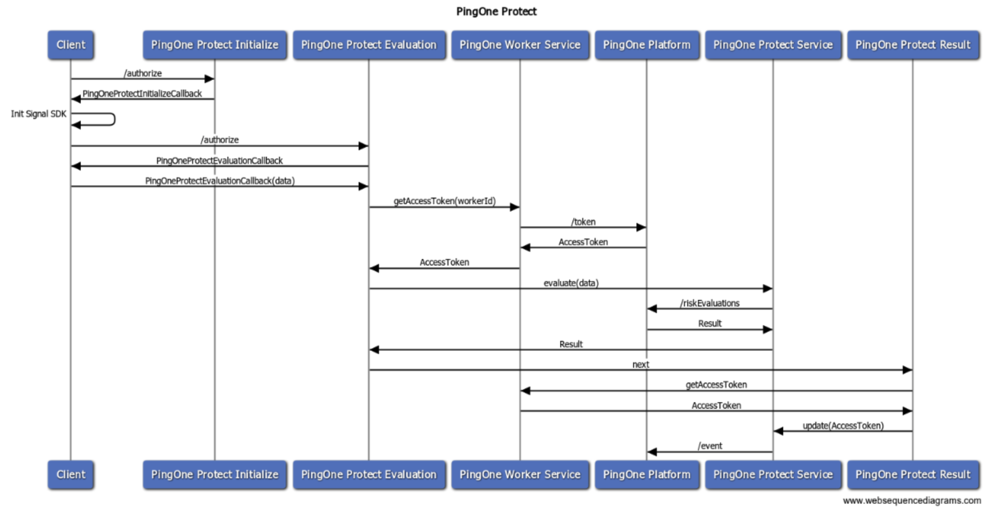
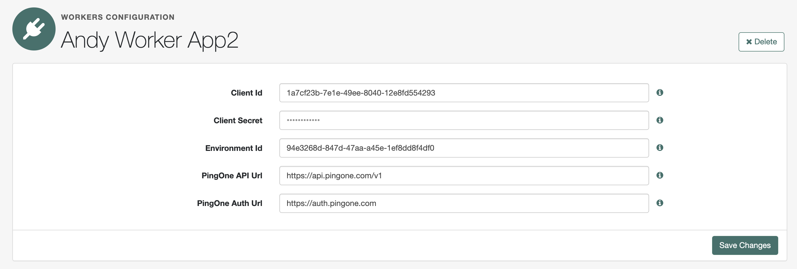
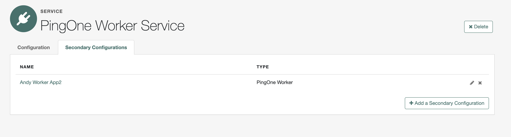
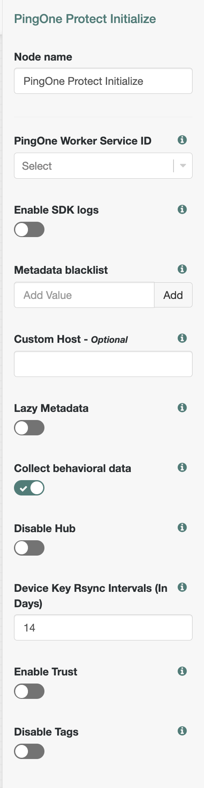
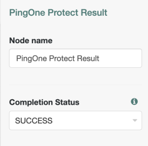
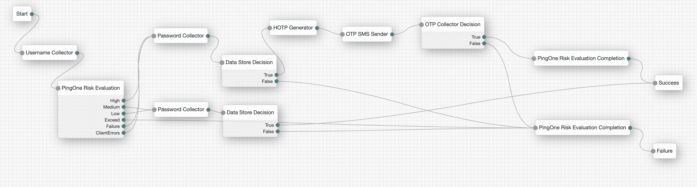

<h1 id="title-text" class="with-breadcrumbs" style="display: block;">
                                                <a href="/confluence/pages/viewpage.action?pageId=174753324">PingOne Protect Node &amp; SDK (Latest)</a>
                                    </h1>

<h1 id="PingOneProtectNode&amp;SDK(Latest)-ServerArchitectureDesign">Server Architecture Design</h1>

<table class="wrapped confluenceTable tablesorter tablesorter-default stickyTableHeaders" role="grid" style="padding: 0px;" resolved=""><colgroup><col><col></colgroup><thead class="tableFloatingHeaderOriginal" style="position: static; margin-top: 0px; left: 325px; z-index: 3; width: 983px; top: 91px;"><tr role="row" class="tablesorter-headerRow"><th scope="col" class="confluenceTh tablesorter-header sortableHeader tablesorter-headerUnSorted" data-column="0" tabindex="0" role="columnheader" aria-disabled="false" unselectable="on" aria-sort="none" aria-label="Component: No sort applied, activate to apply an ascending sort" style="user-select: none; min-width: 8px; max-width: none;">
Component
</th><th scope="col" class="confluenceTh tablesorter-header sortableHeader tablesorter-headerUnSorted" data-column="1" tabindex="0" role="columnheader" aria-disabled="false" unselectable="on" aria-sort="none" aria-label="Description: No sort applied, activate to apply an ascending sort" style="user-select: none; min-width: 8px; max-width: none;">

Description</th></tr></thead><tbody aria-live="polite" aria-relevant="all"><tr role="row"><td class="confluenceTd">PingOne Risk Initialize Node</td><td class="confluenceTd">Provide Signal SDK configuration attribute, and instruct the client to initialize the Signal SDK.</td></tr><tr role="row"><td class="confluenceTd">PingOne Risk Evaluation Node</td><td class="confluenceTd">Handle requests and responses from clients, analyze risk results, and route to outcome.&nbsp;</td></tr><tr role="row"><td class="confluenceTd">PingOne Risk Result Node</td><td class="confluenceTd">Update evaluation authentication status.</td></tr><tr role="row"><td class="confluenceTd">PingOne Worker Service</td><td class="confluenceTd">
Manage PingOne AccessToken, Client Credential OAuth2 Request to PingOne Platform, and cache the AccessToken.

This component can be reused by other PingOne integrations. For example, PingOne Verify.
</td></tr><tr role="row"><td class="confluenceTd">PingOne Protect Service</td><td class="confluenceTd">As API Client to PingOne Protect APIs.</td></tr></tbody></table>

A typical journey to use OTP when Risk is High.

## PingOne Worker Service

Work with the PingOne Worker Application (With <strong>Roles Environment Admin</strong> and <strong>Identity Data Admin</strong>) and retrieve a Client Credential Grant Access Token, the Access Token will be cached until expires or the service configuration is updated.

Refer to <a https="https://github.com/ForgeRock/tntp-ping-service">PingOne Service </a>for setting up

 

Support Multiple PingOne Worker, each worker works with each PingOne Application

<h2 id="PingOneProtectNode&amp;SDK(Latest)-PingOneProtectInitializeNode">PingOne Protect Initialize Node</h2>

Instruct the client to initialize the SDK

## Inputs

`None`

## Configurations

<table>
<thead>
<th>Property</th>
<th>usage</th>
</thead>

<tr>
<td>PingOne Worker Service ID</td>
<td>The ID of the PingOne worker service for connecting to PingOne.</td>
</tr>
<tr>
<td>Enable SDK Logs</td>
<td>When enabled, output SDK log messages in the developer console. Default is not enabled.
</td>
</tr>
<tr>
<td>Custom Host</td>
<td>Custom Host to retrieve the "Pong" token.
</td>
</tr>
<tr>
<td>Disable Hub</td>
<td>When selected, the client stores device data in the browser's localStorage only. When not selected (the default), an iframe is used.
</td>
</tr>
<tr>
<td>Device Attributes To Ignore</td>
<td>A list of device attributes to ignore when collecting device signals.</td>
</tr>
<tr>
<td>Lazy Metadata</td>
<td>When enabled, calculate the metadata only on getData invocation, otherwise do it automatically on init. default is false
</td>
</tr>
<tr>
<td>Collect Behavioral Data</td>
<td>When enabled (the default), collect behavioral data. When not enabled, behavioral data is not collected.</td>
</tr><tr>
<td>Disable Tags</td>
<td>When enabled the SDK will collect tag data. When not enabled (the default), tag data is not collected.
</td>
</tr><tr>
<td>Device Key Rsync Intervals (days)
</td>
<td>Number of days used to window the next time the device attestation should use the device fallback key. default is 14 days</td>
</tr><tr>
<td>Enable Trust</td>
<td>Tie the device payload to a non-extractable crypto key stored on the browser for content authenticity verification</td>
</tr>

</table>

## Outputs

`None`

## Outcomes

`Next`

Successfully initialized

`Error`

Error initializing 

## PingOne Protect Evaluation Node

Provide input to the <a class="external-link" href="https://apidocs.pingidentity.com/pingone/platform/v1/api/#post-create-risk-evaluation" rel="nofollow">Create Risk Evaluation</a> API and evaluate response.

 The Node parses part of the API response and routes to the corresponding outcome (according to the <a class="external-link" href="https://docs.pingidentity.com/r/en-us/pingone/pingone_protect_best_practices" rel="nofollow">best practice</a>, it should use score-based policies):

## Inputs

Must have initialized the PingOne Service <strong>successfully</strong> before continuing to this node

## Configurations

[//]: # (<table class="wrapped confluenceTable taablesorter tablesorter-default stickyTableHeaders" role="grid" style="padding: 0px;" resolved=""><colgroup><col><col></colgroup><thead class="tableFloatingHeaderOriginal" style="position: static; margin-top: 0px; left: 325px; z-index: 3; width: 1283px; top: 91px;"><tr role="row" class="tablesorter-headerRow"><th scope="col" class="confluenceTh tablesorter-header sortableHeader tablesorter-headerUnSorted" data-column="0" tabindex="0" role="columnheader" aria-disabled="false" unselectable="on" aria-sort="none" aria-label="Label &#40;*PingOne API specific attribute&#41;: No sort applied, activate to apply an ascending sort" style="user-select: none; min-width: 8px; max-width: none;">
Label &#40;*PingOne API specific attribute&#41;
</th><th scope="col" class="confluenceTh tablesorter-header sortableHeader tablesorter-headerUnSorted" data-column="1" tabindex="0" role="columnheader" aria-disabled="false" unselectable="on" aria-sort="none" aria-label="Description &#40;Some attribute definitions can be found here&#41;: No sort applied, activate to apply an ascending sort" style="user-select: none; min-width: 8px; max-width: none;">
Description &#40;Some attribute definitions can be found <a class="external-link" href="https://apidocs.pingidentity.com/pingone/platform/v1/api/#risk-evaluations" rel="nofollow">here</a>&#41;
</th></tr></thead><tbody aria-live="polite" aria-relevant="all"><tr role="row"><td class="confluenceTd">PingOne Worker Service ID</td><td class="confluenceTd">The identifier of your PingOne Worker service you create to connect to the Google Play Integrity servers.</td></tr><tr role="row"><td class="confluenceTd">Score Threshold Exceed</td><td class="confluenceTd">Outcome to exceed when risk score is greater than score limit. &#40;Recommend by Itai Zach Default to 300&#41;</td></tr><tr role="row"><td class="confluenceTd">The ID of the target application.&nbsp;-&nbsp;<em class="small">Optional</em></td><td class="confluenceTd">The ID of the target application.</td></tr><tr role="row"><td class="confluenceTd">The risk policy set's unique identifier.&nbsp;-&nbsp;<em class="small">Optional</em></td><td class="confluenceTd">The risk policy set's unique identifier. if not specified, the environment's default risk policy set is used.</td></tr><tr role="row"><td class="confluenceTd">Flow Type</td><td class="confluenceTd">The type of flow for which the risk evaluation is being carried out. Can take any of the following values:<ul><li>"REGISTRATION" - initial registration of an account</li><li>"AUTHENTICATION" - standard authentication for login or actions such as password change</li><li>"ACCESS" - verification of whether user can access the relevant application, using tools such as PingAccess</li><li>"AUTHORIZATION" - verification of whether user is authorized to perform a specific action such as a profile change, using tools such as PingOne Authorize</li><li>"TRANSACTION" - authentication carried out in the context of a purchase or other monetary transaction</li></ul></td></tr><tr role="row"><td class="confluenceTd">Device Sharing Type</td><td class="confluenceTd">The device sharing type. Options are UNSPECIFIED, SHARED, and PRIVATE.</td></tr><tr role="row"><td class="confluenceTd">Shared state attribute for UserId&nbsp;-&nbsp;<em class="small">Optional</em></td><td class="confluenceTd">
The Node state variable that contains the user.id as it appears in PingOne. &nbsp; If left blank, the node uses the current context Username as the user.id
</td></tr><tr role="row"><td class="confluenceTd">Shared state attribute for Username&nbsp;-&nbsp;<em class="small">Optional</em></td><td class="confluenceTd"><pre data-bidi-marker="true">The Node state variable that contains the <a class="external-link" href="http://user.name" rel="nofollow">user.name</a> as it appears in PingOne. &nbsp; If left blank, the node uses the current context Username as the <a class="external-link" href="http://user.name" rel="nofollow">user.name</a>.</pre></td></tr><tr role="row"><td class="confluenceTd">User Type</td><td class="confluenceTd">The type of user associated with the event. The possible values are PING_ONE and EXTERNAL.</td></tr><tr role="row"><td class="confluenceTd">Store Risk Evaluation Result In Transient State</td><td class="confluenceTd">
Stores the risk evaluation response in the <strong>transient</strong> <strong>state</strong> with the key named&nbsp;<strong><code>PingOneRiskEvaluationNode.RISK</code>.</strong> <em>Note</em>: The key is empty if the node cannot retrieve the risk from PingOne.
</td></tr><tr role="row"><td class="confluenceTd">Recommended Action</td><td class="confluenceTd">
Dynamic Outcome for recommendation Action
</td></tr><tr role="row"><td class="confluenceTd">Pause Behavioral Data</td><td class="confluenceTd">
Instruct the client to pause behavioral data.
</td></tr><tr role="row"><td class="confluenceTd">Client error outcomes</td><td class="confluenceTd">Specify the custom error outcomes that the client can return.</td></tr></tbody></table>)

<table>
<thead>
<th>Property</th>
<th>Usage</th>
</thead>

<tr>
<td>Target App ID</td>
<td>The ID of the target application.</td>
</tr>

<tr>
<td>PingOne Worker Service ID</td>
<td>The ID of the PingOne worker service for connecting to PingOne.</td>
</tr>

<tr>
<td>Risk Policy Set ID</td>
<td>The ID of the risk policy set.   
 If not specified, the environment's default risk policy set is used.</td>
</tr>

<tr>
<td>Score Threshold</td>
<td>Scoring higher than this value results in evaluation continuing along the 
  <strong>Exceeds Score Threshold</strong> outcome.</td>
</tr>

<tr>
<td>Flow Type</td>
<td>The type of flow or event for which the risk evaluation is being carried out. Choose from: 
 <ul><li><code>REGISTRATION</code> - initial registration of an account</li>
  <li><code>AUTHENTICATION</code> - standard authentication for login or actions such as password change</li>
  <li><code>ACCESS</code> - verification of whether user can access the relevant application</li>
  <li><code>AUTHORIZATION</code> - verification of whether user is authorized to perform a specific action such as a profile change</li>
  <li><code>TRANSACTION</code> - authentication carried out in the context of a purchase or other one-time transaction</li>
  </ul>
</td>
</tr>

<tr>
<td>Device Sharing Type</td>
<td>Whether the device is shared between users or not.   
  Choose from <code>UNSPECIFIED</code>, <code>SHARED</code>, or <code>PRIVATE</code>.</td>
</tr>

<tr>
<td>Node State Attribute For User ID</td>
<td>The node state variable that contains the <code>user.id</code> as it appears in PingOne Protect.   
  If left blank, the node uses the current context <code>UserId</code> as the user.id.</td>
</tr>

<tr>
<td>Node State Attribute For Username</td>
<td>The node state variable that contains the <code>user.name</code> as it appears in PingOne Protect.   
  If left blank, the node uses the current context <code>Username</code> as the user.name.</td>
</tr>

<tr>
<td>User Type</td>
<td>The type of user associated with the event.   
  Choose from <code>PING_ONE</code> or <code>EXTERNAL</code>.</td>
</tr><tr>
<td>Pause Behavioral Data</td>
<td>After receiving the device signal, instruct the client to pause collecting behavioral data.</td>
</tr><tr>
<td>Store Risk Evaluation</td>
<td>Stores the risk evaluation response in node state under a key named 
  <code>PingOneProtectEvaluationNode.RISK</code>.  
  <em>Note</em>: The key is empty if the node is unable to retrieve a risk evaluation from PingOne.</td>
</tr><tr>
<td>Recommended Actions</td>
<td>A list of recommended actions the risk evaluation could return. Each entry in the list 
  becomes a node outcome. If the score does not exceed the threshold and a recommended action is present in
  the evaluation, the journey continues down the matching entry in this list.</td>
</tr>
</table>

<table class="wrapped confluenceTable tablesorter tablesorter-default stickyTableHeaders" role="grid" style="padding: 0px;" resolved=""><colgroup><col><col><col></colgroup><thead class="tableFloatingHeaderOriginal" style="position: static; margin-top: 0px; left: 325px; z-index: 3; width: 1283px; top: 91px;"><tr role="row" class="tablesorter-headerRow"><th scope="col" class="confluenceTh tablesorter-header sortableHeader tablesorter-headerUnSorted" data-column="0" tabindex="0" role="columnheader" aria-disabled="false" unselectable="on" aria-sort="none" aria-label="Result: No sort applied, activate to apply an ascending sort" style="user-select: none; min-width: 8px; max-width: none;">
Result
</th><th scope="col" class="confluenceTh tablesorter-header sortableHeader tablesorter-headerUnSorted" data-column="1" tabindex="0" role="columnheader" aria-disabled="false" unselectable="on" aria-sort="none" aria-label="Outcome: No sort applied, activate to apply an ascending sort" style="user-select: none; min-width: 8px; max-width: none;">
Outcome
</th><th scope="col" class="confluenceTh tablesorter-header sortableHeader tablesorter-headerUnSorted" data-column="2" tabindex="0" role="columnheader" aria-disabled="false" unselectable="on" aria-sort="none" aria-label="Description: No sort applied, activate to apply an ascending sort" style="user-select: none; min-width: 8px; max-width: none;">
Description
</th></tr></thead></thead><tbody aria-live="polite" aria-relevant="all"><tr role="row"><td class="confluenceTd">result.score &gt; ${score limit}</td><td class="confluenceTd"> Exceed Score Threshold</td><td class="confluenceTd">The risk is too high, recommend not to accept the authentication</td></tr><tr role="row"><td class="confluenceTd">result.level = HIGH</td><td class="confluenceTd">High</td><td class="confluenceTd">High-Risk</td></tr><tr role="row"><td class="confluenceTd">result.level = MEDIUM</td><td class="confluenceTd">Medium</td><td class="confluenceTd">Medium-Risk</td></tr><tr role="row"><td class="confluenceTd">result.level = LOW</td><td class="confluenceTd">Low</td><td class="confluenceTd">Low-Risk</td></tr><tr role="row"><td class="confluenceTd"> </td><td class="confluenceTd">&lt;Configurable Outcome&gt;</td><td class="confluenceTd">If result with recommendedAction, and match with the predefined "Recommended Actions", the Node will route to the recommended Action outcome.</td></tr><tr role="row"><td class="confluenceTd"> </td><td class="confluenceTd">Failure</td><td class="confluenceTd">Any failure to retrieve the API result, e.g. Invalid Access Token, Network Error, API Error, etc...</td></tr><tr role="row"><td class="confluenceTd"> </td><td class="confluenceTd">ClientErrors</td><td class="confluenceTd">Any error from the client or SDK</td></tr></tbody></table>

After successfully calling the API, the Shared State "PingOneRiskEvaluationNode.riskEvalID" will be set with the created
ID, and later on we need to use the riskEvalID to update the evaluation status with PingOne Risk Result Node.

<h3 id="PingOneProtectNode&amp;SDK(Latest)-Outcomeresultprecedence">Outcome result 
precedence</h3>

<table class="wrapped confluenceTable stickyTableHeaders" resolved="" style="padding: 0px;"><thead class="tableFloatingHeaderOriginal" style="position: static; margin-top: 0px; left: 325px; z-index: 3; width: 983px; top: 91px;"><tr><th scope="col" class="confluenceTh" style="min-width: 8px; max-width: none;">Exceed Score Threshold)</th><th scope="col" class="confluenceTh" style="min-width: 8px; max-width: none;">→&nbsp;</th><th scope="col" class="confluenceTh" style="min-width: 8px; max-width: none;">Recommended Action (When response with recommendedAction and match with predefined</th><th scope="col" class="confluenceTh" style="min-width: 8px; max-width: none;">→&nbsp;</th><th scope="col" class="confluenceTh" style="min-width: 8px; max-width: none;">Level</th></tr></thead><colgroup><col><col><col><col><col></colgroup><tbody></tbody></table>

## Outputs

`Score`

What the user scored with the Evaluation

`Risk Level`

The level of risk the user poses

## Outcomes

`High`

User poses a High risk

`Medium`

User poses a Medium risk

`Low`

User poses a Low risk

`Exceed`

 User exceeded the risk

`Failure`

Evaluation failed for the user

`Error`

An error occurred causing the evaluation to fail

## PingOne Protect Result Node

Update the final authentication result, so that the Risk Evaluation learns the result of the risk evaluation.

## Inputs

`Risk level`
 

## Configurations
<table>
<thead>
<th>Property</th>
<th>Usage</th>
</thead>

<tr>
<td>Completion Status</td>
<td>The state of the transaction. Options are FAILED and SUCCESS.</td>
</tr>

</table>

## Outputs

`Risk result`

## Outcomes

`Next`

Went through the evaluation process
## Troubleshooting

If these nodes log an error, review the log messages the find the reason for the error and address the issue appropriately.

## Example journey

